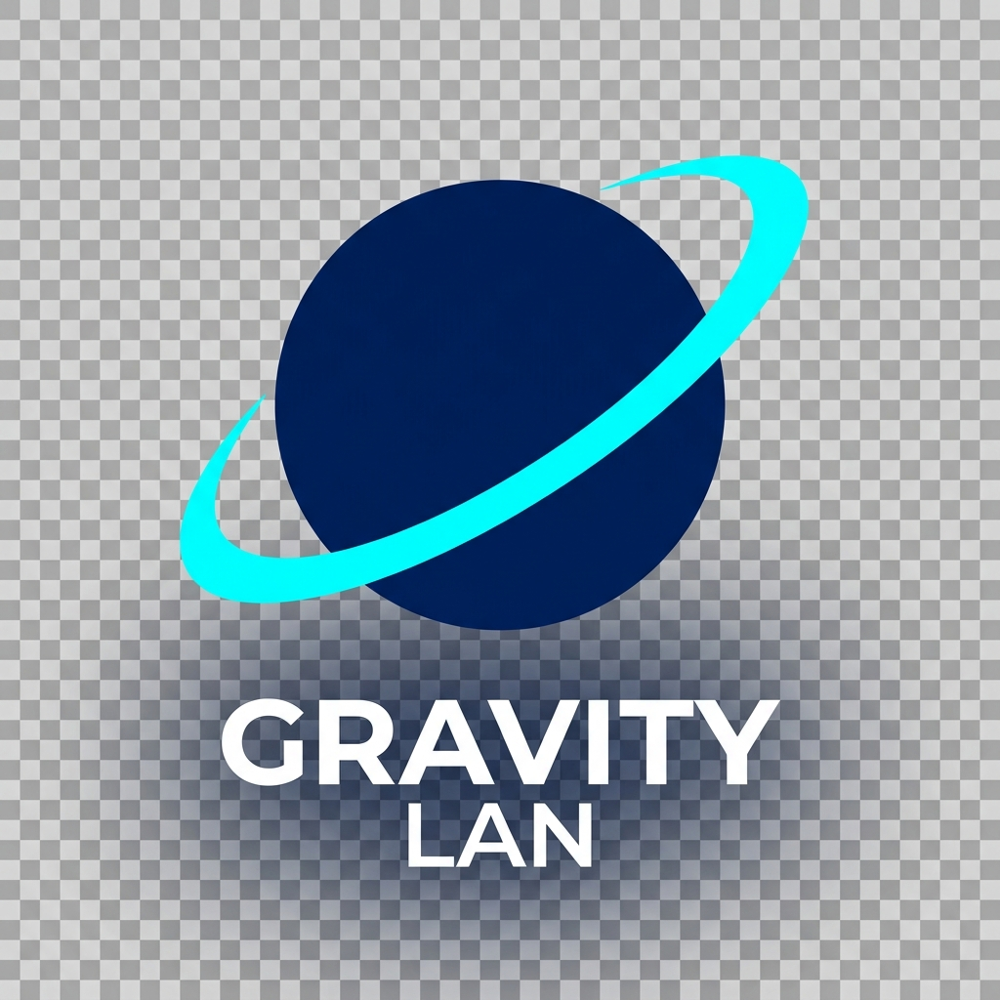

<p align="center">
  
</p>

<h1 align="center">GravityLAN 🌌</h1>

<p align="center">
  <strong>The minimalist Homelab network radar.</strong>
</p>

<p align="center">
  
  
  
</p>

---

**GravityLAN** is a lightweight network dashboard built for Homelab enthusiasts. It provides an immediate overview of your infrastructure with zero tedious setup.

> [!NOTE]
> **100% Vibe Coded** — Built with AI to keep Homelab monitoring simple and aesthetic.

---

## ✨ Features

- **⚡ Zero-Config Discovery**: Automatic subnet scanning and hostname resolution.
- **🚀 ARP Turbo Mode**: Real-time discovery via local ARP tables.
- **🧠 Smart Fingerprinting**: Automatic port-based device classification (Home Assistant, Proxmox, etc.).
- **🎨 Drag-&-Drop UI**: Fully customizable and persistent dashboard layout.
- **📱 Responsive**: Optimized for desktop, tablet, and mobile.

---

## 📸 Screenshots

### 🖥️ Dashboard
The central hub for all your monitored devices.


### 🗺️ Network Planner & Editor
Discover new devices and customize their details.


### 🤖 System Agent
Deep system insights for Linux machines.


---

## 🛠️ Tech Stack

GravityLAN is built with modern, high-performance frameworks:

- **Backend**: [FastAPI](https://fastapi.tiangolo.com/), [SQLAlchemy 2.0](https://www.sqlalchemy.org/), [Nmap](https://nmap.org/).
- **Frontend**: [React 18](https://react.dev/), [TypeScript](https://www.typescriptlang.org/), [Vite](https://vitejs.dev/).

---

## 🚀 Getting Started

### 🐳 Docker (Recommended)
```yaml
services:
  gravitylan:
    image: sleeperxr/gravitylan:latest
    container_name: GravityLAN
    network_mode: host
    volumes:
      - ./data:/app/backend/data
    restart: unless-stopped
```

> [!IMPORTANT]
> Use **Host Network Mode** to allow the scanner to see your local LAN devices.

### 🛠️ Windows Development Setup
1.  **Install Nmap**: Download from [nmap.org](https://nmap.org/download.html) and ensure it's in your **PATH**.
2.  **Install Python 3.12+ & Node.js 18+**.
3.  **Run Startup Script**:
    ```powershell
    .\start_gravitylan.ps1
    ```

---

## 🤖 GravityLAN Agent

The optional resource agent provides deep system insights for Linux-based machines.

- **Metrics**: CPU utilization, RAM usage, Disk space, and Temperature sensors.
- **Deployment**:
  - **One-Click**: Deploy via SSH directly from the Device Editor.
  - **Manual**: Simple `curl | bash` installation script.
- **Lightweight**: Uses standard Python libraries only (no external dependencies).

---

## 🔍 Under the Hood

### How Scans Work
1.  **Layer 2 Discovery**: Uses `arp-scan` to find devices even if they block ICMP (Ping).
2.  **Layer 3 Monitoring**: Real-time status monitoring via ICMP Echo Requests.
3.  **Hostname Resolution**: Queries gateways and DNS resolvers for local names.
4.  **Fingerprinting**: Async TCP scanner checks common Homelab ports to assign icons and links.

### Architecture
1.  **Planner**: Fast discovery focused on finding new devices.
2.  **Dashboard**: Continuous health monitoring for confirmed infrastructure.
3.  **Sync**: MAC-based identity persistence for handling DHCP changes.

---

## 🤝 Contributing & License

[MIT License](LICENSE) • [GitHub Issues](https://github.com/SleeperXr/GravityLAN/issues)

---

<p align="center">
  Made with ❤️ by <strong>SleeperXr</strong>
</p>


