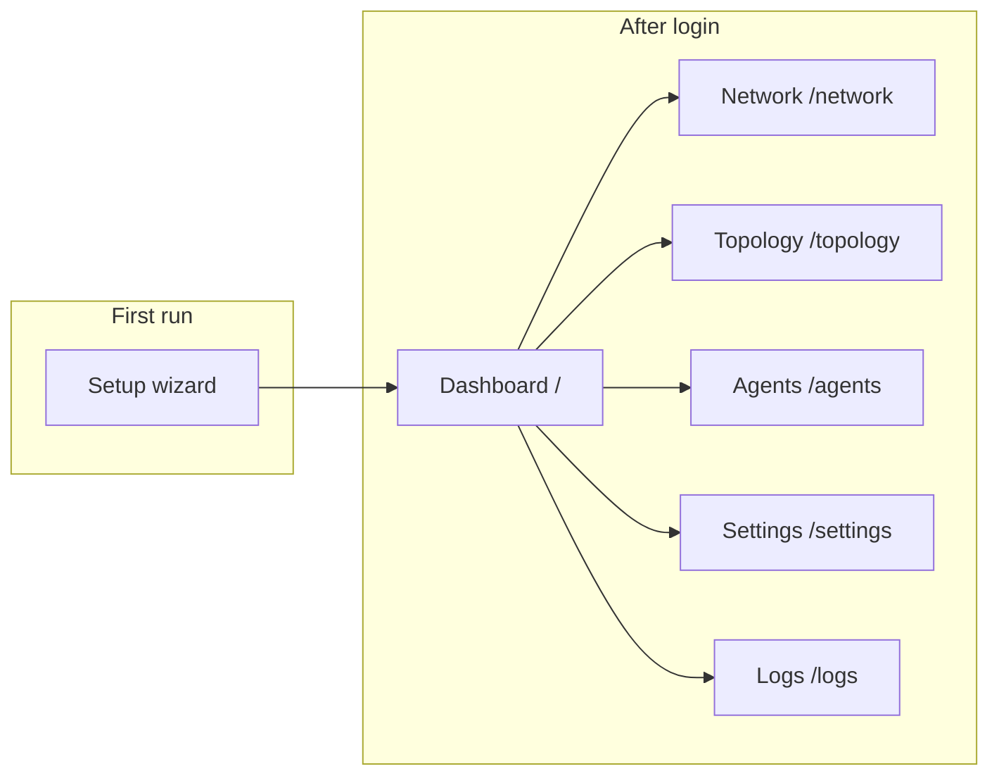
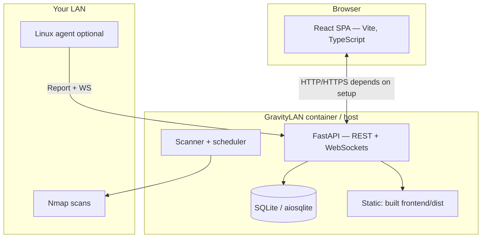
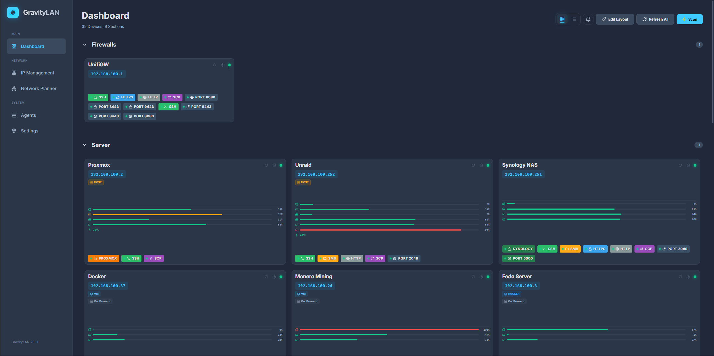
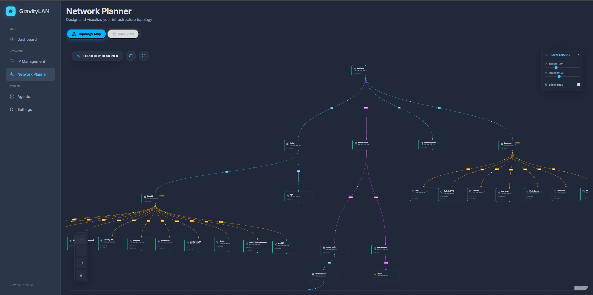
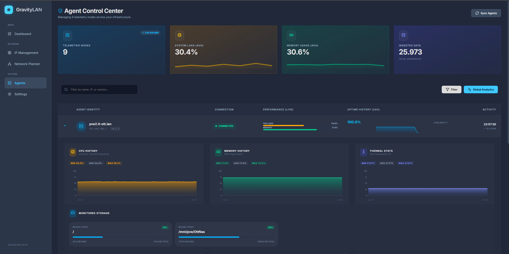
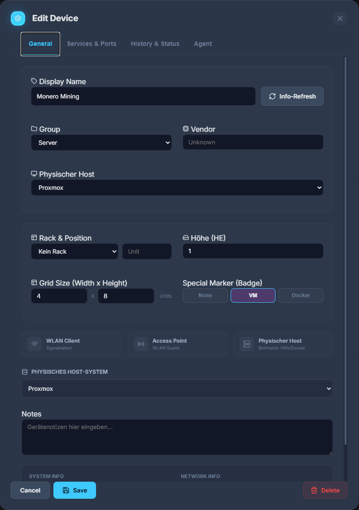
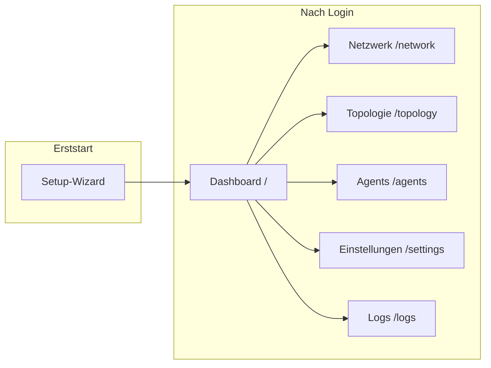
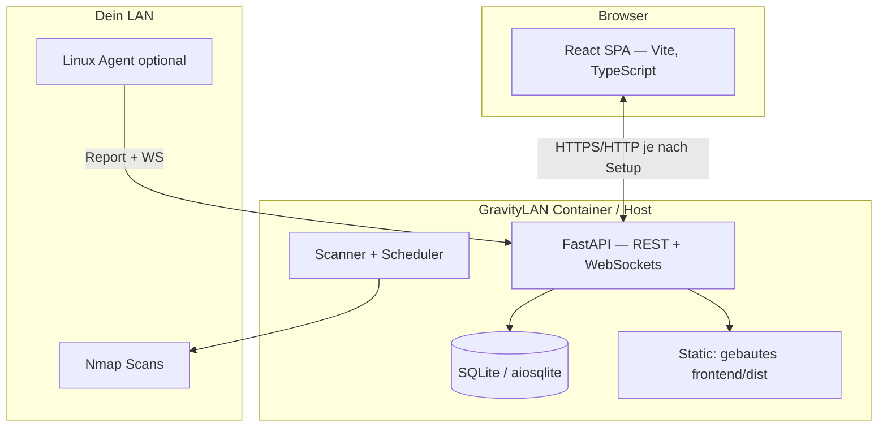

<p align="center">
  
</p>

<h1 align="center">GravityLAN</h1>

<p align="center">
  <strong>EN:</strong> Your homelab radar — discover the network, organise devices, sketch topology, add agents.<br>
  <strong>DE:</strong> Dein Homelab-Radar — Netz finden, Geräte sortieren, Topologie skizzieren, Agenten draufpacken.<br><br>
  <em>EN: No enterprise drama. Run it and see what’s on your LAN. · DE: Kein Enterprise-Drama. Einfach laufen lassen und gucken, was im LAN passiert.</em>
</p>

<p align="center">
  <a href="#english">English</a> · <a href="#deutsch">Deutsch</a>
</p>

<p align="center">
  
  
  
  
  
</p>

---

<a id="english"></a>

## English

> **100% vibe coded** — Built with enthusiasm, velocity, and a healthy “ship it first” attitude: FastAPI backend, React UI, SQLite, Nmap, WebSockets. Meant for your **homelab**, not bare exposure on the public internet (use VPN like you already would).

### What GravityLAN does

| Area | In short |
|------|----------|
| **Discovery (scanner)** | Scan subnets, find hosts, rough-in ports and services — answers “what’s on my LAN again?”. |
| **Dashboard** | Device overview, status, groups — your main panel after login. |
| **Network (`/network`)** | Manage subnets, enable/disable, basis for LAN scans. |
| **Topology (`/topology`)** | Model racks and links — physical or logical, your choice. |
| **Agents (`/agents`)** | Optional **Linux agent** (Python): push metrics; deploy from the UI over SSH; per-device tokens. |
| **Settings (`/settings`)** | App config, scan scheduler, themes, log level, etc. |
| **Live logs (`/logs`)** | Backend logs via WebSocket — handy for debugging or “is the scan still running?”. |
| **Setup wizard** | First boot: prepare data dir/DB and access, then the normal UI. |
| **Backup / restore** | JSON export/import of core tables — homelab convenience before experiments or migrations. |
| **API (`/docs`)** | Swagger UI — for curl nerds and automation. |

### UI navigation



### Architecture at a glance



**Main backend modules** (same concepts as the UI): `auth`, `setup`, `scanner`, `devices` / `groups` / `services`, `network`, `topology`, `agent`, `backup`, `settings`.

### Screenshots

| Dashboard | Network planner |
|:---:|:---:|
|  |  |

| Agents | Device editor |
|:---:|:---:|
|  |  |

### Tech stack

| Layer | Choice |
|-------|--------|
| **Backend** | Python 3.12+, FastAPI, SQLAlchemy 2 (async), Pydantic Settings |
| **Database** | SQLite under configurable data path |
| **Scanner** | Nmap (host/subnet orchestration in the app) |
| **Frontend** | React 19, Vite, TypeScript, Router, Tailwind |
| **Realtime** | WebSockets (scanner progress, logs, agent) |
| **Deploy** | Multi-stage Dockerfile (frontend build + Python runtime), optional Compose / Macvlan (e.g. Unraid-style) |

### Requirements

- **Docker** (recommended) or **Windows/Linux** for local dev  
- **Nmap** (included in the image mindset; install locally too if not using containers)  
- **Node 20+** / **npm** — only when building the frontend yourself  

### Quick start (Docker)

Single build: `docker/Dockerfile` (multi-stage: Vite → static assets + Python). Persistent data: **`GRAVITYLAN_DATA_DIR`** (often `/app/data` in the image — confirm in your Compose/image).

```bash
docker build -f docker/Dockerfile -t gravitylan:local .
docker run -d --name gravitylan \
  -p 8000:8000 \
  -v gravitylan-data:/app/data \
  --cap-add=NET_RAW --cap-add=NET_ADMIN \
  gravitylan:local
```

Open **http://localhost:8000** → finish setup → log in.

- **Compose**: see `docker-compose.yml` / `docker-compose-test.yml` for examples (e.g. Macvlan / fixed LAN IP — tune `parent`, subnet, IP).  
- **Host networking** trades container isolation for the simplest LAN interface access during scans — valid when you want that.

### Development (Windows)

1. Install **Python 3.12+**, **Node 20+**, **Nmap**, **Git**.  
2. From repo root:

```powershell
.\start_gravitylan.ps1
```

Runs **Uvicorn** on `http://0.0.0.0:8000` and **Vite** on `http://127.0.0.1:5173`.

> **Single-process SPA:** Run `cd frontend && npm run build` so FastAPI serves `frontend/dist` or `/app/static` — same pattern as the release image.

### Environment variables (selected)

| Variable | Meaning | Default |
|----------|---------|---------|
| `GRAVITYLAN_DATA_DIR` | SQLite + persistence path | depends on deployment (often `/data` locally, `/app/data` in image) |
| `GRAVITYLAN_DATABASE_URL` | Full SQLAlchemy URL (optional) | empty → SQLite under data dir |
| `GRAVITYLAN_DEBUG` | Verbose logging | `false` |
| `GRAVITYLAN_CORS_ORIGINS` | CORS for dev split frontend | includes localhost:5173 |
| `GRAVITYLAN_SCAN_TIMEOUT` | Per-target timeout (seconds) | `1.5` |
| `GRAVITYLAN_SCAN_WORKERS` | Scanner concurrency | `20` |

Keys like **`api.master_token`** / **`api.admin_password`** live in the DB via setup/UI — see `backend/app/config.py` and the settings API.

### Repository layout

```
agent/                 # gravitylan-agent.py (+ systemd unit template)
backend/app/           # FastAPI: api/, models/, scanner/, services/, …
frontend/              # React (Vite, TypeScript)
docker/                # Dockerfile
docs/screenshots/      # README images
```

Interactive API: **`/docs`** (Swagger) while the server runs.

### GravityLAN Agent (optional)

- One **Python script** + config (server URL + device token).  
- Reports metrics with `Authorization: Bearer <token>` to the agent API.  
- Live WebSockets accept master or device agent token depending on endpoint.  
- SSH creds used for “deploy from UI” exist only **for that request**, not persisted in DB for passwords/keys in that flow.

### Homelab note (short)

GravityLAN assumes a **friendly home network**. Login/tokens gate the UI and streams; they’re not a full internet-facing perimeter story. Remote access → VPN or your usual reverse proxy, same as the rest of the lab.

### License & credits

Open source under the [MIT License](LICENSE). Built with **Antigravity** and “maybe too much UI fun” by **SleeperXr**.

---

<a id="deutsch"></a>

## Deutsch

> **100% vibe coded** — Dieses Projekt ist mit Ideenfeuer, Schnelligkeit und „erst mal shippen“ entstanden: FastAPI-Backend, React-UI, SQLite, Nmap, WebSockets. Perfekt fürs **Heimnetz / Homelab**, nicht fürs öffentliche Internet ohne VPN.

### Was GravityLAN für dich tut

| Bereich | Kurz erklärt |
|--------|----------------|
| **Erkennung (Scanner)** | Subnetze scannen, Hosts finden, Ports und Dienste grob einordnen — ideal, um „was hängt nochmal bei mir im Netz?“ zu beantworten. |
| **Dashboard** | Übersicht über Geräte, Status, Gruppen — dein zentrales Panel nach dem Login. |
| **Netzwerk (`/network`)** | Subnetze verwalten, aktivieren/deaktivieren, Scan-Basis für dein LAN. |
| **Topologie (`/topology`)** | Racks und Verbindungen modellieren — physisch oder logisch, wie es dir passt. |
| **Agents (`/agents`)** | Optionaler **Linux-Agent** (Python): Metriken melden; Deployment per UI (SSH), Tokens pro Gerät. |
| **Einstellungen (`/settings`)** | App-Konfiguration, Scan-Scheduler, Themes, Log-Level u. a. |
| **Live-Logs (`/logs`)** | Backend-Logs per WebSocket — praktisch beim Debuggen oder „läuft der Scan noch?“. |
| **Setup-Wizard** | Erststart: Datenordner/DB anlegen, Zugang einrichten, danach normale Oberfläche. |
| **Backup / Restore** | JSON-Export/-Import der wichtigen Tabellen — Homelab-Komfort beim Umzug oder vor Experimenten. |
| **API (`/docs`)** | Swagger UI — wenn du lieber curl oder Automatisierung nutzt. |

### Navigation in der Oberfläche



### Architektur auf einen Blick



**Wichtige Backend-Module:** `auth`, `setup`, `scanner`, `devices` / `groups` / `services`, `network`, `topology`, `agent`, `backup`, `settings`.

### Screenshots

| Dashboard | Netzwerk-Planer |
|:---:|:---:|
|  |  |

| Agents | Gerät-Editor |
|:---:|:---:|
|  |  |

### Tech-Stack

| Schicht | Wahl |
|--------|-----|
| **Backend** | Python 3.12+, FastAPI, SQLAlchemy 2 (async), Pydantic Settings |
| **Datenbank** | SQLite unter konfigurierbarem Datenpfad |
| **Scanner** | Nmap (Host/Subnet-Logik über die App) |
| **Frontend** | React 19, Vite, TypeScript, Router, Tailwind |
| **Echtzeit** | WebSockets (Scanner-Fortschritt, Logs, Agent) |
| **Deploy** | Multi-Stage Dockerfile, optional Compose mit Macvlan/Unraid-Stil |

### Voraussetzungen

- **Docker** (empfohlen) *oder* **Windows/Linux** zum lokalen Entwickeln  
- **Nmap** (im Docker-Image mitgedacht; lokal installieren wenn du ohne Container scannst)  
- **Node 20+** und **npm** — nur wenn du das Frontend selbst baust  

### Schnellstart mit Docker

Einheitlicher Build unter `docker/Dockerfile`. Persistente Daten: **`GRAVITYLAN_DATA_DIR`** (im Image oft `/app/data`).

```bash
docker build -f docker/Dockerfile -t gravitylan:local .
docker run -d --name gravitylan \
  -p 8000:8000 \
  -v gravitylan-data:/app/data \
  --cap-add=NET_RAW --cap-add=NET_ADMIN \
  gravitylan:local
```

Öffne **http://localhost:8000** → Setup abschließen → einloggen.

- **Compose:** `docker-compose.yml` / `docker-compose-test.yml` als Beispiele (Macvlan/Unraid usw.).  
- **Host-Netzwerk-Mode:** mehr LAN-Nähe, weniger Container-Isolation — bewusst so nutzbar.

### Entwicklung unter Windows

1. **Python 3.12+**, **Node 20+**, **Nmap**, **Git** installieren.  
2. Im Repo-Root:

```powershell
.\start_gravitylan.ps1
```

Startet **Uvicorn** auf `http://0.0.0.0:8000` und **Vite** auf `http://127.0.0.1:5173`.

> **SPA aus einem Prozess:** `cd frontend && npm run build` — FastAPI liefert `frontend/dist` bzw. `/app/static`, wie im Release-Image.

### Umgebungsvariablen (Auswahl)

| Variable | Bedeutung | Default |
|----------|-----------|---------|
| `GRAVITYLAN_DATA_DIR` | Persistenzpfad für SQLite und Daten | je nach Deployment |
| `GRAVITYLAN_DATABASE_URL` | Volle SQLAlchemy-URL optional | leer → SQLite |
| `GRAVITYLAN_DEBUG` | Ausführlichere Logs | `false` |
| `GRAVITYLAN_CORS_ORIGINS` | CORS (Dev mit Vite) | u. a. localhost:5173 |
| `GRAVITYLAN_SCAN_TIMEOUT` | Timeout pro Scan-Ziel (Sekunden) | `1.5` |
| `GRAVITYLAN_SCAN_WORKERS` | Parallelität Scanner | `20` |

Weitere Schlüssel wie **`api.master_token`**, **`api.admin_password`** → Setup/UI/DB (`backend/app/config.py`).

### Repo-Übersicht

```
agent/                 # gravitylan-agent.py (+ systemd-Vorlage)
backend/app/           # FastAPI: api/, models/, scanner/, …
frontend/              # React (Vite, TypeScript)
docker/                # Dockerfile
docs/screenshots/      # README-Bilder
```

**API:** `/docs` (Swagger).

### GravityLAN Agent (optional)

- Ein **Python-Skript** + Config (Server-URL + Geräte-Token).  
- Metriken per `Authorization: Bearer <token>` an die Agent-API.  
- WebSockets für Live-Ansichten: Master- oder Agent-Token je nach Endpunkt.  
- SSH-Zugangsdaten für „Deploy aus der UI“ nur **während** der Anfrage — keine dauerhafte Speicherung von Passwort/Key in diesem Flow.

### Homelab-Hinweis

Für ein **vertrauenswürdiges Heimnetz gedacht.** Von unterwegs: VPN oder Reverse-Proxy, wie gewohnt im Lab.

### Lizenz

Open Source unter der [MIT License](LICENSE).

Gebaut mit **Antigravity**, Kaffee und „ein bisschen zu viel Spaß am UI“ von **SleeperXr**.
