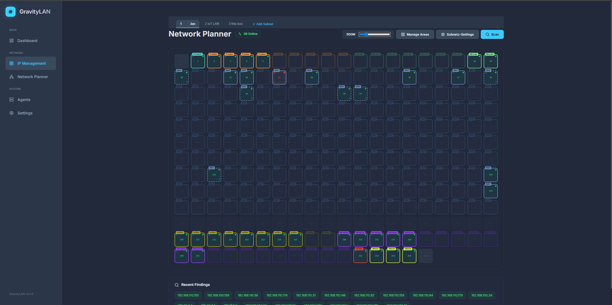
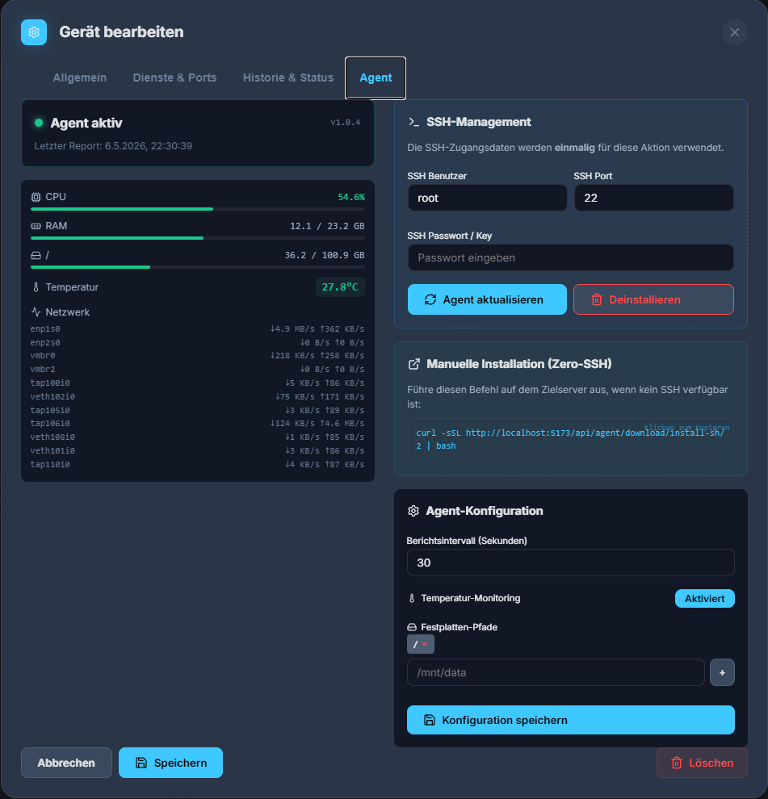

# GravityLAN 🌌

**GravityLAN** is a modern, lightweight, and incredibly practical Homelab network radar and dashboard. Designed to give you an immediate overview of your network without the tedious, hours-long setup typical of enterprise monitoring solutions.

> **100% Vibe Coded** 
> *This tool (and most of this documentation) was generated entirely through "vibe coding" with AI. I just wanted a practical, good-looking tool to keep an overview of my Homelab without having to play sysadmin for 3 days straight. What you see is the result of that vision.*  
> — **SleeperXr**

---

## 🎯 Why GravityLAN?

Managing a Homelab shouldn't require setting up a bloated enterprise monitoring stack just to see if your Proxmox server or Home Assistant instance is online. GravityLAN is built to be deployed in seconds (via Docker), instantly scan your subnets, and give you a beautiful, customizable drag-and-drop dashboard.


*(GravityLAN Dashboard with custom groups)*

## ✨ Core Features

*   **⚡ Zero-Config Network Discovery**  
    Automatically scans multiple subnets (e.g., `192.168.1.0/24`, `10.0.0.0/24`) to find devices, resolve hostnames, and detect MAC vendors.
*   **🚀 ARP Turbo Mode**  
    An ultra-fast discovery engine that monitors the local ARP table in real-time. New devices are often detected within 10 seconds of joining the network.
*   **🧠 Smart Service Fingerprinting**  
    Automatically classifies devices by open ports (Home Assistant, Proxmox, ioBroker, etc.).
*   **🛠️ Modular Scanner Architecture**  
    Clean separation between the **Network Planner** (fast discovery) and the **Dashboard** (deep health/service monitoring) for maximum performance and stability.
*   **🎨 Dynamic Drag-&-Drop Dashboard**  
    Group and arrange your devices exactly how you want. GravityLAN remembers your custom layout natively.
*   **🌍 Multi-Language Ready (i18n)**  
    Full support for English and German out of the box.

## 🛠️ Tech Stack & Environment

GravityLAN is built with a clear separation of concerns using modern, high-performance frameworks:

### Backend (The Brain)
*   **[FastAPI](https://fastapi.tiangolo.com/):** High-performance Python 3.12+ web framework.
*   **[SQLAlchemy 2.0](https://www.sqlalchemy.org/):** Modern async ORM for robust data management.
*   **[Nmap](https://nmap.org/):** The gold standard for network discovery and security auditing.

### Frontend (The Radar)
*   **[React 18](https://react.dev/) & [TypeScript](https://www.typescriptlang.org/):** For a robust, type-safe, and highly reactive user interface.
*   **[Vite](https://vitejs.dev/):** Next-generation frontend tooling for blazingly fast development and builds.

---

## 🚀 Getting Started

### Docker (Recommended)
The easiest way to run GravityLAN is via Docker Compose:

```yaml
services:
  gravitylan:
    image: sleeperxr/gravitylan:latest
    container_name: GravityLAN
    network_mode: host # Required for Nmap raw sockets and discovery
    volumes:
      - /path/to/data:/app/backend/data
    restart: unless-stopped
```

### Windows Development
For local testing or development on Windows, we provide simple PowerShell scripts that handle everything (Dependency installation, Backend & Frontend startup):

1.  Open a PowerShell terminal in the project root.
2.  Run `.\start_gravitylan.ps1` to start the stack.
3.  Run `.\stop_gravitylan.ps1` to stop all processes.

---

## 🏗️ Architecture: The New Scanner Engine
We recently refactored the entire scanning core to ensure GravityLAN stays fast even as your Homelab grows:

1.  **Planner Engine**: Focused on finding *new* devices as fast as possible using ARP and lightweight ICMP/TCP probes.
2.  **Dashboard Engine**: Focused on monitoring the *health* and *services* of your confirmed infrastructure.
3.  **Sync Logic**: A centralized deduplication engine that handles IP changes (DHCP renewals) automatically using MAC-based identity.

---

## 📸 Screenshots

### The Network Planner


### Smart Device Editor


### Zero-SSH Agent Deployment


---

## 🤝 Contributing
GravityLAN is an open-source project. Feel free to open issues or pull requests if you have ideas for new service fingerprints or features!

---

## 📜 License
MIT License - feel free to use, modify, and distribute.

---

> [!TIP]
> Always run GravityLAN in **Host Network Mode**. Bridged networks will prevent the ARP scanner from seeing other devices on your LAN.

## 🔍 Under the Hood

### How the Scan Process Works
GravityLAN is built for speed and precision in local environments. The scanning engine operates in multiple stages:
1.  **Layer 2 Discovery (ARP):** The primary scan uses `arp-scan` or local ARP cache lookups. This allows GravityLAN to find devices even if they are blocking ICMP (Ping) requests, providing a much higher detection rate for mobile devices and firewalls.
2.  **Layer 3 Monitoring (ICMP):** Once a device is known, its real-time status is monitored via ICMP Echo Requests (Pings).
3.  **Hostname Resolution:** GravityLAN queries hostnames directly from your network's primary gateways and DNS resolvers using low-level socket queries, often resolving local names that standard OS-level tools might miss.
4.  **Service Fingerprinting (Port Scan):** A high-performance async TCP scanner checks common Homelab ports (80, 443, 8006, 8123, 9000, etc.). Based on the combination of open ports, GravityLAN automatically assigns the correct service icons and links.

### The GravityLAN Agent
The optional resource agent provides deep system insights for your Linux-based machines (Debian, Ubuntu, Proxmox, CentOS, etc.).

*   **Dependencies:**
    *   **Python 3.7+:** Must be installed on the target system (pre-installed on almost all modern Linux distros).
    *   **Standard Library Only:** The agent uses only Python built-in modules to remain as lightweight and non-intrusive as possible.
    *   **SSH Server:** Required only for the "Auto-Deploy" feature from the UI.
*   **Deployment Methods:**
    *   **One-Click Deploy:** Enter your SSH credentials in the Device Editor. GravityLAN connects once, uploads the agent, sets up a systemd-style service (or cron), and starts reporting. Your credentials are **not** stored.
    *   **Manual Install:** For high-security environments, GravityLAN provides a simple `curl | bash` command you can paste into your terminal.
*   **Metrics Gathered:** Real-time CPU utilization (per core), RAM usage, Disk space (customizable paths), and system temperature sensors.

---

## 🚀 Quick Start (Docker / Unraid)

GravityLAN is designed to run in a `macvlan` Docker network so it can accurately scan your local subnets without NAT interference.

1. Clone the repository:
   ```bash
   git clone https://github.com/SleeperXr/GravityLAN.git
   cd GravityLAN
   ```
2. Adjust the `docker-compose.yml` to match your local network interface (e.g., `eth0`, `br0`) and subnet.
3. Bring it up:
   ```bash
   docker compose up -d
   ```
4. Open your browser and navigate to the IP you assigned to the container (e.g., `http://192.168.1.200`).

*(Note for Unraid Users: Simply use the Unraid Docker UI, set the Network Type to `Custom: br0`, and assign a static IP!)*

## 🤝 Contributing

Since this project is *vibe coded*, it's constantly evolving based on what feels right for a Homelab. Feel free to open issues, submit PRs, or just leave a star if it saved you from setting up a massive enterprise dashboard!
