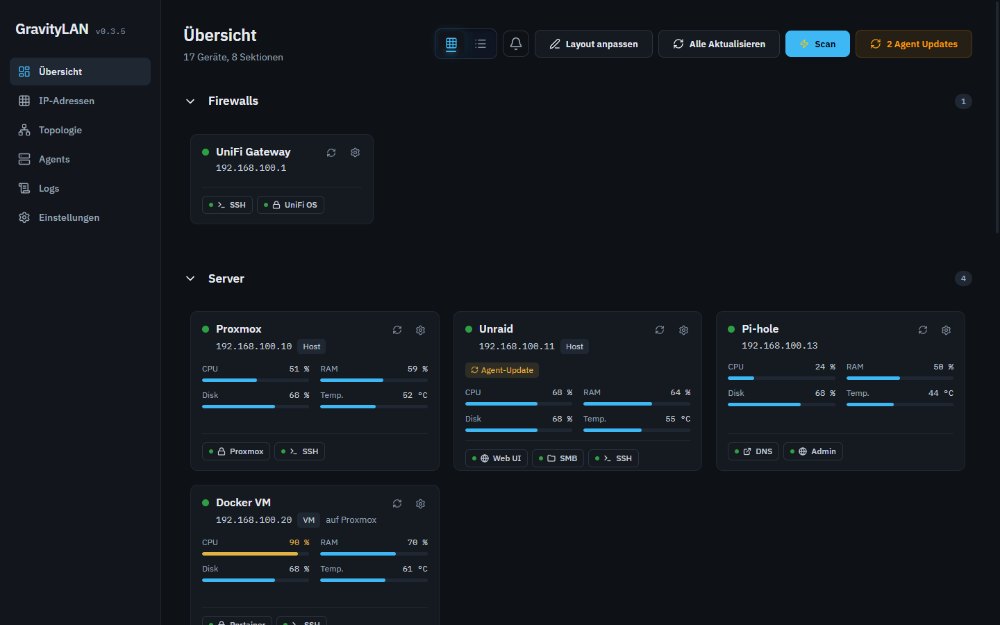
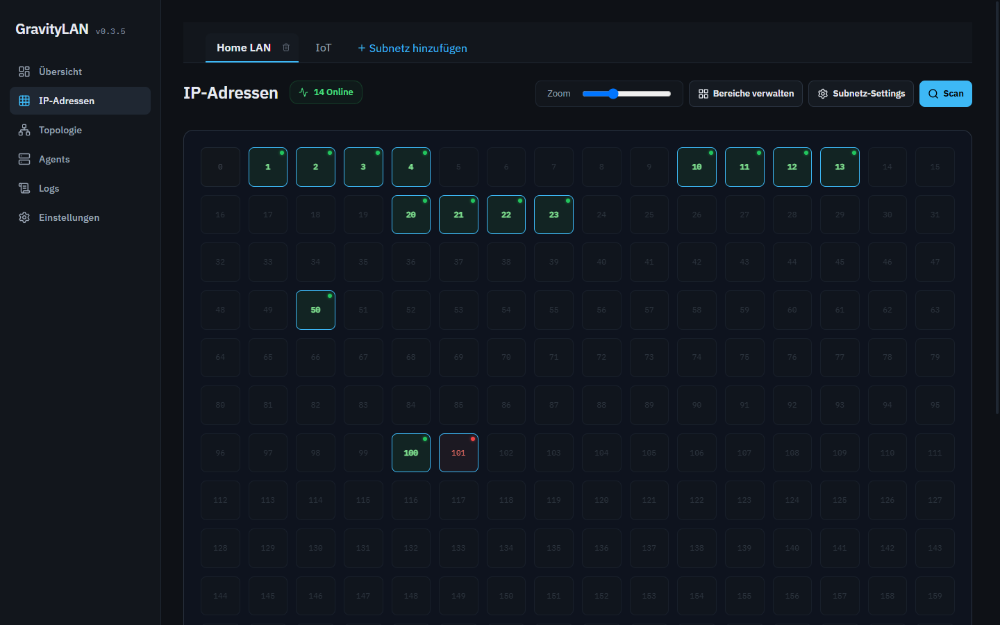
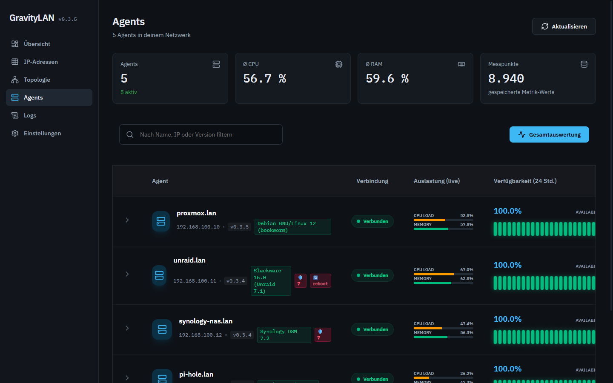
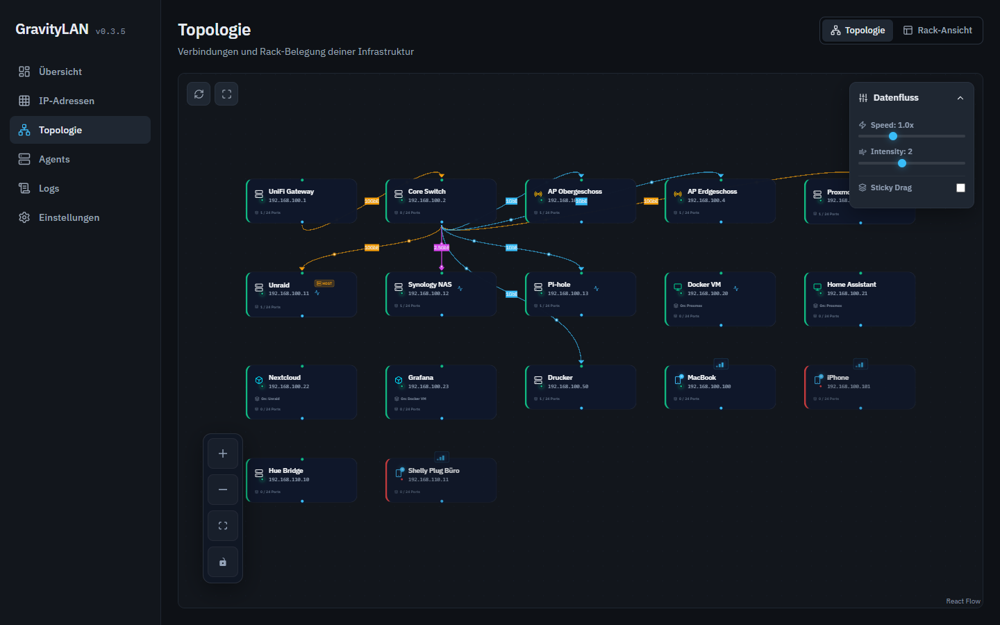
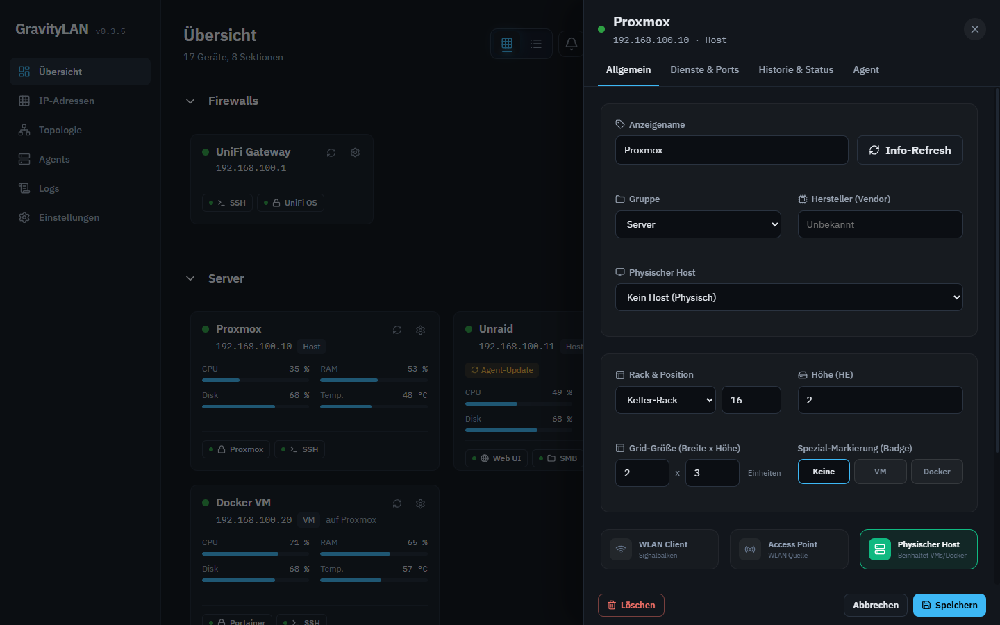
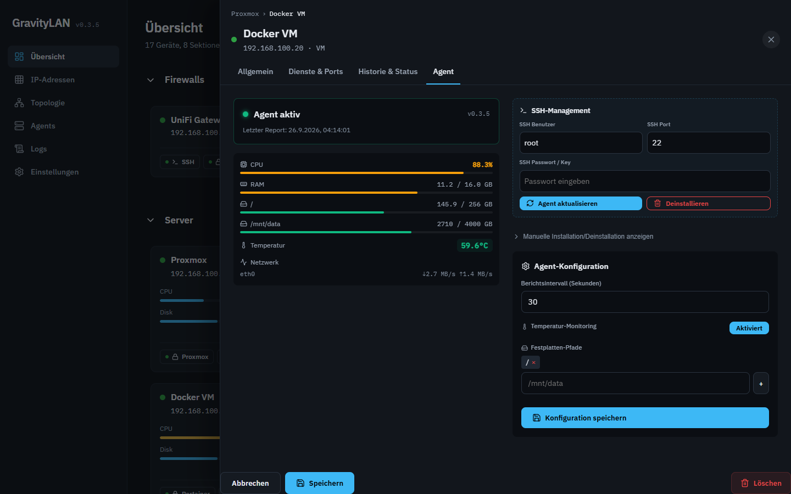
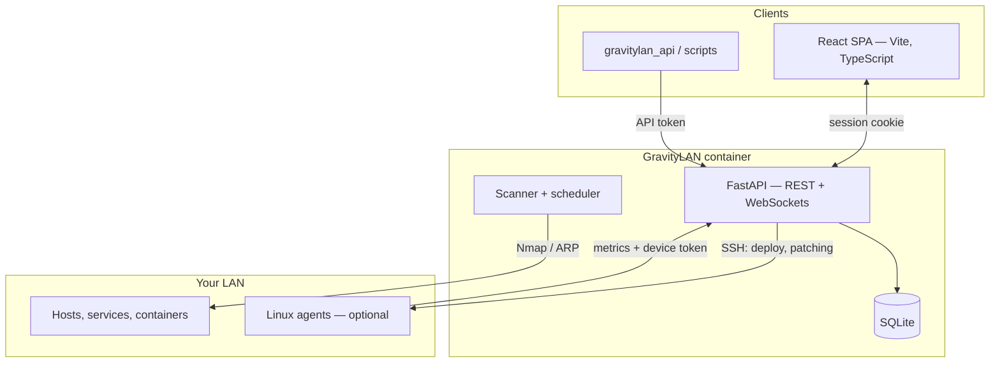
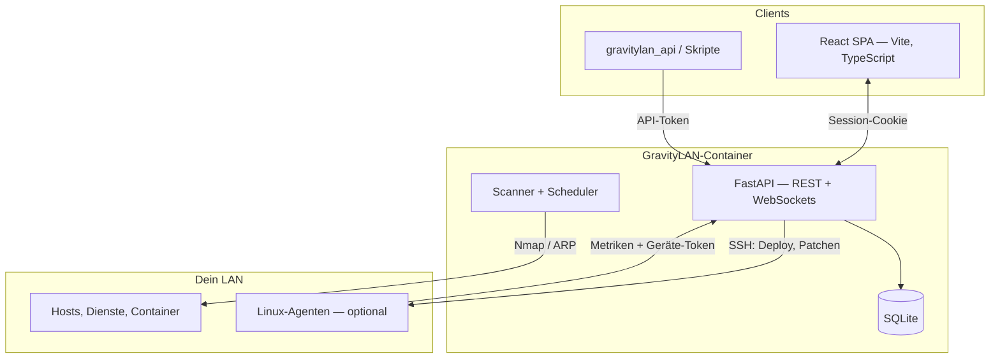

<p align="center">
  
</p>

<h1 align="center">GravityLAN</h1>

<p align="center">
  <strong>EN:</strong> Your homelab radar — discover the network, organise devices, sketch topology, add agents.<br>
  <strong>DE:</strong> Dein Homelab-Radar — Netz finden, Geräte sortieren, Topologie skizzieren, Agenten draufpacken.
</p>

<p align="center">
  <a href="#english">English</a> · <a href="#deutsch">Deutsch</a>
</p>

<p align="center">
  
  
  
  <a href="https://github.com/SleeperXr/GravityLAN/actions/workflows/ci.yml"></a>
  
  
  
  
  <a href="https://hub.docker.com/r/sleeperxr/gravitylan"></a>
</p>

> [!WARNING]
> **Pre-release:** GravityLAN is still evolving. Features and APIs may change between versions and you may hit bugs — keep a backup (Settings → Backup) before upgrading.

---

<a id="english"></a>

## English

GravityLAN scans your home network, keeps an inventory of every device it finds, lets you model racks and cabling, and — optionally — monitors and patches your Linux hosts through a small agent. One container, one SQLite file, a React dashboard on top. Built for the **homelab**, not for bare exposure on the internet.

### Features

| Area | What you get |
|------|--------------|
| **Discovery** | Scheduled Nmap/ARP scans of your subnets: hosts, open ports, services, vendor lookup, Docker containers (including `ipvlan` setups with shared MACs). |
| **Dashboard** | All devices with status, groups and service health; IP-change history, issues and a notification feed. |
| **Network** (`/network`) | Manage subnets, enable/disable them as scan targets, per-IP view of your address space. |
| **Topology** (`/topology`) | Model racks, devices and links — physical or logical. |
| **Agents** (`/agents`) | Optional Linux agent: CPU/RAM/disk/network/temperature metrics with 6 h – 30 d history, OS detection, available package updates (apt/dnf/yum) and one-click patching with a live terminal. |
| **Settings** (`/settings`) | Scan schedule, history retention, read-only API tokens, themes, log level, backup/restore. |
| **Live logs** (`/logs`) | Backend log stream via WebSocket. |
| **Setup wizard** | First start: detect subnets, run the first scan, set the admin password. |
| **API** (`/docs`) | Full REST API with Swagger UI (incl. webhooks and scan profiles), plus a Python client (`gravitylan_api`). |

### Screenshots

| Dashboard | Network planner |
|:---:|:---:|
|  |  |

| Agents | Topology designer |
|:---:|:---:|
|  |  |

| Device editor | Device editor — agent tab |
|:---:|:---:|
|  |  |

### Quick start (Docker)

```bash
docker run -d --name gravitylan \
  -p 8000:8000 \
  -v gravitylan-data:/app/data \
  --cap-add=NET_RAW --cap-add=NET_ADMIN \
  sleeperxr/gravitylan:latest
```

Open **http://localhost:8000**, finish the setup wizard, log in.

> [!IMPORTANT]
> **Finish the setup wizard right after the first start.** Until setup is completed, only the wizard's own routes are reachable, but whoever opens the UI first sets the admin password. The same applies after a factory reset.

**Compose variants** (all use the Docker Hub image):

| File | Networking | When to use |
|------|------------|-------------|
| `docker-compose.yml` | Bridge, port 8000 | Simplest start. ARP/MAC detection only sees what the bridge exposes. |
| `docker-compose.hostnet.yml` | Host network | Best LAN visibility (ARP, MAC addresses, multicast). Less container isolation. |
| `docker-compose.unraid.yml` | Host network | Unraid template-style setup. |
| `docker-compose.macvlan.yml` | Macvlan, own LAN IP | Container gets its own address in your LAN (configure `GRAVITYLAN_SUBNET`, `_GATEWAY`, `_IP`, `_INTERFACE`). |

Build the image yourself instead: `docker build -t gravitylan:local .` (multi-stage: Vite build + Python runtime, runs as non-root user).

### GravityLAN agent (optional)

A single Python script that runs as a service on your Linux hosts and reports metrics with a per-device token. Two ways to install it, both from the device editor's **Agent** tab:

1. **Deploy via SSH** — enter SSH credentials, GravityLAN installs and starts the agent (systemd, Synology rc.d or nohup fallback). Credentials are used for that request only and never stored on the server.
2. **Manual one-liner** — copy the `curl … | sudo bash` command and run it on the host. The command contains a **one-time code** (valid 30 minutes, usable once); get a new one with "New code".

Uninstall works the same way (via SSH or the uninstall one-liner). Package updates are counted passively by the agent; running updates is done on demand over SSH from the Agents view. Details: [AGENT.md](AGENT.md).

### Python client

The client lives in [`gravitylan_api/`](gravitylan_api) and only needs `requests`. Use it from the repository root (or put the repository root on your `PYTHONPATH`):

```python
from gravitylan_api import GravityLANClient

client = GravityLANClient(base_url="http://gravitylan.local:8000", token="<API token>")
for device in client.devices.list():
    print(device["display_name"], device["ip"])
```

Create API tokens under **Settings → API Tokens (Read-Only)**. The client also reads `GRAVITYLAN_BASE_URL` and `GRAVITYLAN_TOKEN` from the environment.

### Configuration

Environment variables (prefix `GRAVITYLAN_`, see `backend/app/config.py`):

| Variable | Meaning | Default |
|----------|---------|---------|
| `GRAVITYLAN_DATA_DIR` | Data directory (SQLite database) | `/app/data` |
| `GRAVITYLAN_DATABASE_URL` | Full SQLAlchemy URL (optional) | empty → SQLite in data dir |
| `GRAVITYLAN_PORT` / `GRAVITYLAN_HOST` | Listen port / address | `8000` / `0.0.0.0` |
| `GRAVITYLAN_DEBUG` | Verbose logging | `false` |
| `GRAVITYLAN_SECURE_COOKIES` | Mark the session cookie `Secure` — enable behind HTTPS | `false` |
| `GRAVITYLAN_SSH_STRICT_MODE` | Reject unknown SSH host keys during agent deploy and patching | `false` |
| `GRAVITYLAN_HISTORY_RETENTION_DAYS` | Keep metrics/history for N days (1–365) | `30` |
| `GRAVITYLAN_SCAN_TIMEOUT` | Port connect timeout per target (seconds) | `1.5` |
| `GRAVITYLAN_SCAN_WORKERS` | Scanner concurrency | `20` |
| `GRAVITYLAN_SCAN_INTERVAL_MINUTES` | Auto-scan interval (0 = disabled) | `0` |
| `GRAVITYLAN_CORS_ORIGINS` | Extra CORS origins (not needed with the bundled UI or the Vite dev proxy) | empty |

The admin password, the master API token and most runtime options live in the database and are managed through the setup wizard and the Settings page.

### Security at a glance

- **Login** sets an `httpOnly` session cookie; passwords are hashed with Argon2.
- **API tokens** are stored hashed, scoped and read-only by default; each agent has its own device token.
- **Agent install** uses SSH credentials only for the request, or a single-use enrollment code for the manual one-liner.
- **Remote access:** GravityLAN assumes a trusted home network — use a VPN or your usual reverse proxy (with HTTPS and `GRAVITYLAN_SECURE_COOKIES=true`).

More: [SECURITY.md](SECURITY.md), [docs/threat-model.md](docs/threat-model.md), [docs/container-hardening.md](docs/container-hardening.md).

### Architecture


```mermaid
flowchart TB
  subgraph client [Clients]
    SPA[React SPA — Vite, TypeScript]
    PY[gravitylan_api / scripts]
  end
  subgraph server [GravityLAN container]
    API[FastAPI — REST + WebSockets]
    SC[Scanner + scheduler]
    DB[(SQLite)]
  end
  subgraph lan [Your LAN]
    HOSTS[Hosts, services, containers]
    AG[Linux agents — optional]
  end
  SPA <-->|session cookie| API
  PY -->|API token| API
  API --> DB
  SC -->|Nmap / ARP| HOSTS
  AG -->|metrics + device token| API
  API -->|SSH: deploy, patching| AG
```

### Development

**Windows:** `.\start_gravitylan.ps1` installs dependencies and starts Uvicorn on `:8000` and Vite on `:5173`.

**Linux/macOS (manual):**

```bash
# Backend (Python 3.12+, Nmap installed)
cd backend
pip install -r requirements.txt
python -m uvicorn app.main:app --reload --host 0.0.0.0 --port 8000

# Frontend (Node 20+), in a second terminal — proxies /api to :8000
cd frontend
npm install
npm run dev
```

For a single-process setup like the release image, run `npm run build` in `frontend/`; FastAPI then serves `frontend/dist`.

**Tests & checks:**

```bash
cd backend && python -m pytest          # backend test suite
python -m pytest gravitylan_api/tests   # Python client (from the repo root)
cd frontend && npx tsc --noEmit         # frontend type check
```

Architecture decisions are recorded in [docs/adr/](docs/adr). Contributions: see [CONTRIBUTING.md](CONTRIBUTING.md); changes per release: [CHANGELOG.md](CHANGELOG.md).

### Repository layout

```
agent/            Linux agent (gravitylan-agent.py) + systemd unit
backend/app/      FastAPI app: api/, models/, schemas/, scanner/, services/, database/
backend/tests/    Backend test suite (pytest)
frontend/         React UI (Vite, TypeScript, Tailwind)
gravitylan_api/   Python client library
docs/             Security, hardening and design docs, ADRs, screenshots
scripts/          Maintenance scripts (e.g. version sync)
```

### License & credits

Open source under the [MIT License](LICENSE). Built with **Antigravity** and "maybe too much UI fun" by **SleeperXr**.

---

<a id="deutsch"></a>

## Deutsch

GravityLAN scannt dein Heimnetz, führt ein Inventar aller gefundenen Geräte, lässt dich Racks und Verkabelung modellieren und überwacht und patcht auf Wunsch deine Linux-Hosts über einen kleinen Agenten. Ein Container, eine SQLite-Datei, ein React-Dashboard obendrauf. Gebaut fürs **Homelab**, nicht für den ungeschützten Betrieb im Internet.

### Funktionen

| Bereich | Was du bekommst |
|--------|------------------|
| **Erkennung** | Geplante Nmap-/ARP-Scans deiner Subnetze: Hosts, offene Ports, Dienste, Hersteller-Erkennung, Docker-Container (auch `ipvlan`-Setups mit geteilter MAC). |
| **Dashboard** | Alle Geräte mit Status, Gruppen und Dienst-Zustand; IP-Wechsel-Historie, Probleme und ein Benachrichtigungs-Feed. |
| **Netzwerk** (`/network`) | Subnetze verwalten, als Scan-Ziel aktivieren/deaktivieren, IP-Übersicht deines Adressraums. |
| **Topologie** (`/topology`) | Racks, Geräte und Verbindungen modellieren — physisch oder logisch. |
| **Agents** (`/agents`) | Optionaler Linux-Agent: CPU-/RAM-/Disk-/Netzwerk-/Temperatur-Metriken mit 6 h – 30 d Historie, OS-Erkennung, verfügbare Paket-Updates (apt/dnf/yum) und Patchen per Klick mit Live-Terminal. |
| **Einstellungen** (`/settings`) | Scan-Zeitplan, Aufbewahrung der Historie, schreibgeschützte API-Token, Themes, Log-Level, Backup/Restore. |
| **Live-Logs** (`/logs`) | Backend-Logs live per WebSocket. |
| **Setup-Wizard** | Erststart: Subnetze erkennen, ersten Scan starten, Admin-Passwort setzen. |
| **API** (`/docs`) | Komplette REST-API mit Swagger UI (inkl. Webhooks und Scan-Profilen), dazu ein Python-Client (`gravitylan_api`). |

### Screenshots

| Dashboard | Netzwerk-Planer |
|:---:|:---:|
|  |  |

| Agents | Topologie-Designer |
|:---:|:---:|
|  |  |

| Geräte-Editor | Geräte-Editor — Agent-Tab |
|:---:|:---:|
|  |  |

### Schnellstart (Docker)

```bash
docker run -d --name gravitylan \
  -p 8000:8000 \
  -v gravitylan-data:/app/data \
  --cap-add=NET_RAW --cap-add=NET_ADMIN \
  sleeperxr/gravitylan:latest
```

**http://localhost:8000** öffnen, Setup-Wizard abschließen, einloggen.

> [!IMPORTANT]
> **Schließ den Setup-Wizard direkt nach dem ersten Start ab.** Bis dahin sind nur die Routen des Wizards erreichbar — aber wer die Oberfläche zuerst öffnet, legt das Admin-Passwort fest. Das gilt genauso nach einem Werksreset.

**Compose-Varianten** (alle mit dem Image von Docker Hub):

| Datei | Netzwerk | Wann sinnvoll |
|------|------------|-------------|
| `docker-compose.yml` | Bridge, Port 8000 | Einfachster Start. ARP/MAC-Erkennung sieht nur, was die Bridge durchreicht. |
| `docker-compose.hostnet.yml` | Host-Netzwerk | Beste Sicht aufs LAN (ARP, MAC-Adressen, Multicast). Weniger Container-Isolation. |
| `docker-compose.unraid.yml` | Host-Netzwerk | Setup im Stil eines Unraid-Templates. |
| `docker-compose.macvlan.yml` | Macvlan, eigene LAN-IP | Container bekommt eine eigene Adresse im LAN (`GRAVITYLAN_SUBNET`, `_GATEWAY`, `_IP`, `_INTERFACE` anpassen). |

Image selbst bauen: `docker build -t gravitylan:local .` (Multi-Stage: Vite-Build + Python-Runtime, läuft als Nicht-root-User).

### GravityLAN-Agent (optional)

Ein einzelnes Python-Skript, das als Dienst auf deinen Linux-Hosts läuft und Metriken mit einem Token pro Gerät meldet. Zwei Installationswege, beide im **Agent**-Tab des Geräte-Editors:

1. **Per SSH ausrollen** — SSH-Zugangsdaten eingeben, GravityLAN installiert und startet den Agenten (systemd, Synology rc.d oder nohup als Fallback). Die Zugangsdaten gelten nur für diese Anfrage und werden auf dem Server nie gespeichert.
2. **Manueller Einzeiler** — den Befehl `curl … | sudo bash` kopieren und auf dem Host ausführen. Er enthält einen **Einmal-Code** (30 Minuten gültig, nur einmal nutzbar); einen neuen gibt es über „Neuer Code“.

Deinstallieren funktioniert genauso (per SSH oder Deinstallations-Einzeiler). Paket-Updates zählt der Agent passiv; eingespielt werden sie auf Wunsch per SSH aus der Agents-Ansicht. Details: [AGENT.md](AGENT.md).

### Python-Client

Der Client liegt in [`gravitylan_api/`](gravitylan_api) und braucht nur `requests`. Nutze ihn aus dem Repo-Root heraus (oder nimm den Repo-Root in deinen `PYTHONPATH` auf):

```python
from gravitylan_api import GravityLANClient

client = GravityLANClient(base_url="http://gravitylan.local:8000", token="<API-Token>")
for device in client.devices.list():
    print(device["display_name"], device["ip"])
```

API-Token erstellst du unter **Einstellungen → API-Token (Read-Only)**. Der Client liest außerdem `GRAVITYLAN_BASE_URL` und `GRAVITYLAN_TOKEN` aus der Umgebung.

### Konfiguration

Umgebungsvariablen (Präfix `GRAVITYLAN_`, siehe `backend/app/config.py`):

| Variable | Bedeutung | Default |
|----------|-----------|---------|
| `GRAVITYLAN_DATA_DIR` | Datenordner (SQLite-Datenbank) | `/app/data` |
| `GRAVITYLAN_DATABASE_URL` | Volle SQLAlchemy-URL (optional) | leer → SQLite im Datenordner |
| `GRAVITYLAN_PORT` / `GRAVITYLAN_HOST` | Port / Adresse | `8000` / `0.0.0.0` |
| `GRAVITYLAN_DEBUG` | Ausführliche Logs | `false` |
| `GRAVITYLAN_SECURE_COOKIES` | Session-Cookie als `Secure` markieren — hinter HTTPS aktivieren | `false` |
| `GRAVITYLAN_SSH_STRICT_MODE` | Unbekannte SSH-Host-Keys bei Agent-Deploy und Patchen ablehnen | `false` |
| `GRAVITYLAN_HISTORY_RETENTION_DAYS` | Metriken/Historie N Tage aufbewahren (1–365) | `30` |
| `GRAVITYLAN_SCAN_TIMEOUT` | Port-Timeout pro Ziel (Sekunden) | `1.5` |
| `GRAVITYLAN_SCAN_WORKERS` | Parallelität des Scanners | `20` |
| `GRAVITYLAN_SCAN_INTERVAL_MINUTES` | Auto-Scan-Intervall (0 = aus) | `0` |
| `GRAVITYLAN_CORS_ORIGINS` | Zusätzliche CORS-Origins (mit der mitgelieferten UI oder dem Vite-Proxy nicht nötig) | leer |

Admin-Passwort, Master-API-Token und die meisten Laufzeit-Optionen liegen in der Datenbank und werden über den Setup-Wizard und die Einstellungen verwaltet.

### Sicherheit auf einen Blick

- **Login** setzt ein `httpOnly`-Session-Cookie; Passwörter werden mit Argon2 gehasht.
- **API-Token** werden gehasht gespeichert, haben Scopes und sind standardmäßig schreibgeschützt; jeder Agent hat sein eigenes Geräte-Token.
- **Agent-Installation** nutzt SSH-Zugangsdaten nur für die Anfrage bzw. einen Einmal-Code für den manuellen Einzeiler.
- **Fernzugriff:** GravityLAN geht von einem vertrauenswürdigen Heimnetz aus — nutze VPN oder deinen gewohnten Reverse-Proxy (mit HTTPS und `GRAVITYLAN_SECURE_COOKIES=true`).

Mehr dazu: [SECURITY.md](SECURITY.md), [docs/threat-model.md](docs/threat-model.md), [docs/container-hardening.md](docs/container-hardening.md).

### Architektur


```mermaid
flowchart TB
  subgraph client [Clients]
    SPA[React SPA — Vite, TypeScript]
    PY[gravitylan_api / Skripte]
  end
  subgraph server [GravityLAN-Container]
    API[FastAPI — REST + WebSockets]
    SC[Scanner + Scheduler]
    DB[(SQLite)]
  end
  subgraph lan [Dein LAN]
    HOSTS[Hosts, Dienste, Container]
    AG[Linux-Agenten — optional]
  end
  SPA <-->|Session-Cookie| API
  PY -->|API-Token| API
  API --> DB
  SC -->|Nmap / ARP| HOSTS
  AG -->|Metriken + Geräte-Token| API
  API -->|SSH: Deploy, Patchen| AG
```

### Entwicklung

**Windows:** `.\start_gravitylan.ps1` installiert die Abhängigkeiten und startet Uvicorn auf `:8000` und Vite auf `:5173`.

**Linux/macOS (manuell):**

```bash
# Backend (Python 3.12+, Nmap installiert)
cd backend
pip install -r requirements.txt
python -m uvicorn app.main:app --reload --host 0.0.0.0 --port 8000

# Frontend (Node 20+), in einem zweiten Terminal — leitet /api an :8000 weiter
cd frontend
npm install
npm run dev
```

Für den Ein-Prozess-Betrieb wie im Release-Image in `frontend/` `npm run build` ausführen; FastAPI liefert dann `frontend/dist` aus.

**Tests & Checks:**

```bash
cd backend && python -m pytest          # Backend-Testsuite
python -m pytest gravitylan_api/tests   # Python-Client (aus dem Repo-Root)
cd frontend && npx tsc --noEmit         # Typprüfung Frontend
```

Architekturentscheidungen stehen in [docs/adr/](docs/adr). Mitmachen: [CONTRIBUTING.md](CONTRIBUTING.md); Änderungen pro Version: [CHANGELOG.md](CHANGELOG.md).

### Repo-Übersicht

```
agent/            Linux-Agent (gravitylan-agent.py) + systemd-Unit
backend/app/      FastAPI-App: api/, models/, schemas/, scanner/, services/, database/
backend/tests/    Backend-Testsuite (pytest)
frontend/         React-UI (Vite, TypeScript, Tailwind)
gravitylan_api/   Python-Client-Bibliothek
docs/             Sicherheits-, Härtungs- und Design-Doku, ADRs, Screenshots
scripts/          Wartungsskripte (z. B. Versions-Sync)
```

### Lizenz

Open Source unter der [MIT License](LICENSE). Gebaut mit **Antigravity**, Kaffee und „ein bisschen zu viel Spaß am UI“ von **SleeperXr**.
