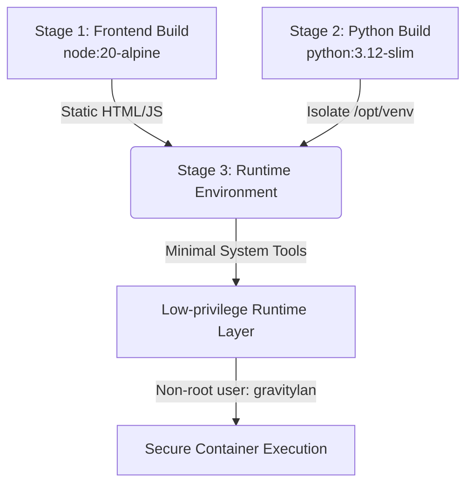

# GravityLAN — Docker Container Hardening Guide

This document outlines the security posture, vulnerability minimization steps, and architectural trade-offs applied to the production GravityLAN Docker container.

---

## 1. Vulnerability & Risk Assessment

A full security scan of standard Python-based Docker containers often reveals multiple OS-level vulnerabilities (CVEs) residing in pre-baked libraries of the base image (e.g., `Debian Bookworm` or `Ubuntu`). 

### Core CVE Drivers in Homelab/Network Tools
1. **OS System Libraries**: Vulnerabilities inside core dependencies like `glibc` (GNU C Library), `openssl`, `libssl`, `systemd`, `libxml2`, and `gnutls`.
2. **Network Clients & Utilities**: Libraries like `curl` and `libcurl` are historically high-frequency targets for remote and local security advisories due to complex parsing and protocol handling.
3. **Compilers & Build Artifacts**: The presence of development headers, compilers (like `gcc`), and temporary build-stage artifacts inside the runtime environment unnecessarily increases the attack surface.

---

## 2. Hardened Architecture Implemented (v0.2.5)

GravityLAN implements a secure, **multi-stage, capabilities-aware build** designed to minimize the final container's attack surface while preserving maximum network discovery performance.



### Hardening Interventions & Mitigations

#### A. Eliminating Curl & Transitioning to Native Python Healthcheck
* **Problem**: Installing the `curl` package for the container `HEALTHCHECK` introduces `curl` and its heavy dependencies (like `libcurl`, `gnutls`), which frequently suffer from network-level vulnerabilities.
* **Solution**: We completely removed `curl` from the runtime dependencies list. The container healthcheck now runs natively in Python using the built-in, dependency-free `urllib.request` module:
  ```dockerfile
  HEALTHCHECK --interval=30s --timeout=10s --start-period=30s --retries=3 \
    CMD python3 -c "import urllib.request, os, sys; port = os.environ.get('GRAVITYLAN_PORT', '8000'); urllib.request.urlopen(f'http://127.0.0.1:{port}/api/health', timeout=5)"
  ```
  This eliminates the need for an external HTTP client, decreasing the image attack surface while providing a more robust, environment-variable-aware health check.

#### B. Absolute Minimal Runtime Dependencies
The final stage installs only essential binaries and system libraries specifically required for network mapping and name resolution, fully isolated from development compilers:
* **`nmap`**: The core asynchronous network scanning engine.
* **`libcap2-bin`**: Used to apply granular Linux capabilities specifically to the `nmap` executable.
* **`iputils-ping`**: Backing utility for ping-based connectivity tests.
* **`avahi-utils`**: Required for `avahi-resolve` to perform local mDNS (multicast DNS) hostname discovery fallback.
* **`iproute2`**: For interface and gateway mapping.
* **`dnsutils`**: Backing utility for `dig` to run reverse DNS fallback resolutions (PTR queries).

---

## 3. The Build Reproducibility vs. Upstream Patching Trade-Off

A key security decision in Docker image design is how to handle OS package patching:

### Rebuilding with Upstream Updates (Preferred)
Rather than executing generic, non-deterministic `apt-get upgrade -y` inside the `Dockerfile`—which introduces dynamic, unpinned dependency drifts and breaks build caching—GravityLAN prioritizes **Build Reproducibility**.

To ensure that the container remains highly deterministic and predictable across environments, package versions are governed by the base `python:3.12-slim` image tag. 

To pull down the newest base OS-level security patches (such as updated `glibc` or `systemd` packages) in a standard, predictable manner, the image should be rebuilt periodically using the `--pull` and `--no-cache` flags:
```bash
docker build --pull --no-cache -t sleeperxr/gravitylan:latest .
```
This forces Docker to pull down the latest officially patched Python base image from the Docker Registry, keeping container packages secure without polluting the Dockerfile with non-deterministic upgrade side-effects.

---

## 4. Runtime Security & Privilege Isolation

To prevent container breakouts or host-level compromise, the following boundary controls are enforced:

1. **Non-Root Execution**: 
   The container does **not** execute as `root`. A dedicated user, `gravitylan`, is created:
   ```dockerfile
   RUN useradd -m -s /bin/bash gravitylan
   USER gravitylan
   ```
2. **Granular Capabilities (`setcap`)**:
   Standard Docker containers run with limited privileges, preventing `nmap` from issuing raw socket commands unless executed as `root`. Rather than running the entire FastAPI application as root, we use `setcap` to grant only the absolute minimum required privileges directly to the `nmap` binary:
   ```dockerfile
   RUN setcap cap_net_raw,cap_net_admin,cap_net_bind_service+eip /usr/bin/nmap
   ```
   This allows the FastAPI backend to run as the non-root `gravitylan` user, but successfully spawns low-privileged `nmap` sub-processes that can perform high-speed ARP, ICMP, and TCP scans.
3. **Docker Compose Capabilities Assignment**:
   To ensure the container can leverage these capabilities, you must include them in your `docker-compose.yml`:
   ```yaml
   services:
     gravitylan-server:
       # ...
       cap_add:
         - NET_RAW
         - NET_ADMIN
   ```

---

## 5. Remaining Risks & Trade-Offs

While the container is highly optimized, certain architectural trade-offs must be acknowledged:

| Package | Purpose | Risk | Alternative / Mitigation |
| :--- | :--- | :--- | :--- |
| **`nmap`** | Raw network scanning | Executable with `cap_net_raw` and `cap_net_admin` capabilities. | Privileges are strictly isolated using `setcap`. FastAPI input validation sanitizes all IP and subnet parameters to prevent command injection. |
| **`avahi-utils` / `dnsutils`** | Hostname resolution fallbacks (`avahi-resolve`, `dig`) | Injects external system utility dependencies into the runtime. | Required to support homelab dynamic networks where standard reverse-DNS might fail. Standardized library implementations (like `dnspython`) are prioritized first, with shell commands acting only as fallback. |
| **Debian Base Slim** | Standard Python runtime | Larger footprint than Alpine or Distroless. | Essential for compiled raw extensions (wheels) and Python-based native database and network libraries. Regularly rebuilt against active python tags to integrate upstream CVE fixes. |
