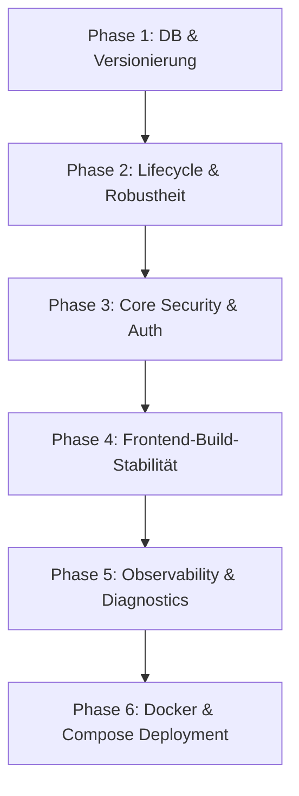

# GravityLAN — 15 Verbesserungen Überarbeiteter Umsetzungsplan

Dieses Dokument beschreibt den technisch präzisierten, risikominimierten Phasenplan zur Implementierung der 15 identifizierten Verbesserungen in GravityLAN.

---

## 1. Kurzfazit: Was wurde am Plan korrigiert?

- **Widersprüche aufgelöst**: Die Grenze zwischen dem kurzfristigen minimal-invasiven Erstschritt (z. B. In-Memory-Sessions) und der strukturellen Zielarchitektur (z. B. persistente Session-Tabelle in der DB) wurde präzise definiert und in getrennte Pfade gegliedert.
- **Pragmatische Homelab-Security**: Cookie-Einstellungen (`SameSite`, `Secure`) wurden für lokale IP-Zugriffe und HTTP-Betrieb flexibel über Umgebungsvariablen konfigurierbar gemacht, statt dogmatisch HTTPS vorauszusetzen.
- **Phasen sauber getrennt**: Frontend-Wartbarkeit (ESLint, strict compilation) wurde von Docker- und Compose-Deployment-Themen isoliert.
- **Realistische Priorisierung**: Robustheit (Lifecycle-Management, SQLite-Locking) und Kernsicherheit (Session-Auth) stehen nun vor sekundären Diagnostics (z. B. Correlation-IDs).
- **Faktische Verifikation**: Annahmen über nicht-existente oder veraltete Audit-Skripte wurden entfernt; stattdessen werden Standard-Testläufe (`pytest`), TypeScript-Kompilierung (`tsc`) und konkrete manuelle Testschritte vorgegeben.

---

## 2. Überarbeitete Phasenreihenfolge

1. **Phase 1: DB & Versionierung (Fundament)** — Verbesserungen 7, 8, 12
2. **Phase 2: Lifecycle & Robustheit (App-Laufzeit)** — Verbesserungen 3, 4, 11
3. **Phase 3: Core Security & Auth (Absicherung)** — Verbesserungen 1, 2, 6, 13
4. **Phase 4: Frontend-Build-Stabilität (Client-Wartbarkeit)** — Frontend Tooling
5. **Phase 5: Observability & Diagnostics (Wartbarkeit)** — Verbesserungen 5, 14
6. **Phase 6: Docker & Compose Deployment (Auslieferung)** — Verbesserungen 9, 10, 15

---

## 3. Überarbeiteter Phasenplan

### Phase 1: DB & Versionierung (Fundament)
- **Ziel**: Dialekt-unabhängige Datenbank-Prüfung und Konsolidierung der Versionierung als Single Source of Truth.
- **Betroffene Dateien**:
  - [backend/app/database/__init__.py](file:///e:/Users/Oliver/Etc/Projekte/Antigravity/GravityLAN/backend/app/database/__init__.py)
  - [backend/app/database/migrations.py](file:///e:/Users/Oliver/Etc/Projekte/Antigravity/GravityLAN/backend/app/database/migrations.py)
  - [backend/app/config.py](file:///e:/Users/Oliver/Etc/Projekte/Antigravity/GravityLAN/backend/app/config.py)
  - [backend/app/version.py](file:///e:/Users/Oliver/Etc/Projekte/Antigravity/GravityLAN/backend/app/version.py)
- **Vorgeschlagene Commits**:
  - `refactor(db): use dialect-agnostic inspection in migrations`
    - SQLite-spezifische Raw-SQL-Abfragen (`PRAGMA table_info`) durch SQLAlchemy `inspect(conn).get_columns()` ersetzen.
  - `feat(version): single source of truth for versioning`
    - `VERSION` in `app/version.py` zentral definieren und in `Settings` importieren; redundante Hardcodings in `main.py` entfernen.

---

### Phase 2: Lifecycle & Robustheit (App-Laufzeit)
- **Ziel**: Geordneter Start/Shutdown der Applikation, Pydantic-basierte Konfigurationsvalidierung und Bereinigung von Background-Tasks.
- **Betroffene Dateien**:
  - [backend/app/config.py](file:///e:/Users/Oliver/Etc/Projekte/Antigravity/GravityLAN/backend/app/config.py)
  - [backend/app/main.py](file:///e:/Users/Oliver/Etc/Projekte/Antigravity/GravityLAN/backend/app/main.py)
- **Vorgeschlagene Commits**:
  - `feat(config): implement strict pydantic settings validation`
    - Grenzwerte für Timeouts, Worker-Anzahl und Hostnames mittels Pydantic `@field_validator` validieren.
  - `refactor(lifecycle): replace sys.exit with runtime exceptions`
    - Keine abrupten Programmabbrüche bei Berechtigungsfehlern während des Starts; stattdessen standardisierte Exceptions werfen, um Uvicorn-Bereinigungen zu erlauben.
  - `refactor(tasks): cancel background loops gracefully during shutdown`
    - Hintergrund-Tasks in `app.state` registrieren und beim Herunterfahren im lifespan-Kontext explizit abbrechen (`task.cancel()`) und abwarten.

---

### Phase 3: Core Security & Auth (Absicherung)
- **Ziel**: Einführung temporärer Sitzungen anstelle des statischen Master-Tokens in Cookies und Vereinheitlichung der WebSocket-Auth.
- **Betroffene Dateien**:
  - [backend/app/api/auth.py](file:///e:/Users/Oliver/Etc/Projekte/Antigravity/GravityLAN/backend/app/api/auth.py)
  - [backend/app/services/auth_service.py](file:///e:/Users/Oliver/Etc/Projekte/Antigravity/GravityLAN/backend/app/services/auth_service.py)
  - [backend/app/main.py](file:///e:/Users/Oliver/Etc/Projekte/Antigravity/GravityLAN/backend/app/main.py)
- **Vorgeschlagene Commits**:
  - `feat(auth): support dynamic sessions and configurable secure cookies`
    - Sitzungsbasierte Authentifizierung einführen; Cookie-Attribute wie `SameSite` und `Secure` konfigurierbar machen (`settings.secure_cookies`), um HTTP-Umgebungen im Homelab zu unterstützen.
  - `refactor(ws): unify websocket authentication helper`
    - Log- und Scanner-WebSockets auf die zentrale `authenticate_websocket`-Methode umstellen.

---

### Phase 4: Frontend-Build-Stabilität (Client-Wartbarkeit)
- **Ziel**: Gewährleistung fehlerfreier und stabiler Builds des Clients sowie strikte Typisierungsprüfungen.
- **Betroffene Dateien**:
  - [frontend/package.json](file:///e:/Users/Oliver/Etc/Projekte/Antigravity/GravityLAN/frontend/package.json)
  - [frontend/tsconfig.json](file:///e:/Users/Oliver/Etc/Projekte/Antigravity/GravityLAN/frontend/tsconfig.json)
- **Vorgeschlagene Commits**:
  - `build(frontend): enable strict tsconfig checks and verify production build`
    - `noImplicitAny` und `strictNullChecks` im Compiler aktivieren, npm-Skripte aufräumen.

---

### Phase 5: Observability & Diagnostics (Wartbarkeit)
- **Ziel**: Logging-Filter reparieren und Korrelations-IDs zur transparenten Fehlerverfolgung im Stack etablieren.
- **Betroffene Dateien**:
  - [backend/app/main.py](file:///e:/Users/Oliver/Etc/Projekte/Antigravity/GravityLAN/backend/app/main.py)
- **Vorgeschlagene Commits**:
  - `feat(observability): propagate correlation ids in requests and errors`
    - Middleware zur Weitergabe von `X-Correlation-ID` im Request-Context und in Fehlerantworten implementieren.
  - `refactor(logging): prevent silencing logs on backend errors`
    - `PollingFilter` so anpassen, dass Log-Einträge von Polling-Endpunkten mit Status `>= 400` oder Level `>= WARNING` niemals unterdrückt werden.

---

### Phase 6: Docker & Compose Deployment (Auslieferung)
- **Ziel**: Härtung des Docker-Images (Multi-Stage Build, Entfernung von Compilern zur Laufzeit) und Bereinigung der Compose-Dateien.
- **Betroffene Dateien**:
  - [Dockerfile](file:///e:/Users/Oliver/Etc/Projekte/Antigravity/GravityLAN/Dockerfile)
  - [docker-compose.yml](file:///e:/Users/Oliver/Etc/Projekte/Antigravity/GravityLAN/docker-compose.yml)
  - [README.md](file:///e:/Users/Oliver/Etc/Projekte/Antigravity/GravityLAN/README.md)
- **Vorgeschlagene Commits**:
  - `docker(engine): harden runtime image using multi-stage builds`
    - Compiler-Werkzeuge (`gcc`, `musl-dev`) in die Build-Stage verbannen; schlankes, compilerfreies Runtime-Image erzeugen.
  - `docker(compose): synchronize environment variables and capabilities`
    - Abgleich der Capabilities (`NET_RAW`, `NET_ADMIN`) und Volumes in Compose-Vorlagen und README.

---

## 4. Explizite Minimalstrategie vs. Zielarchitektur

| Thema | Minimal-Invasiver Erstschritt (Sofort-Schutz) | Strukturelle Zielarchitektur (Zukunft) |
| :--- | :--- | :--- |
| **Auth-Design & Session-Cookie** | Temporärer Session-Cookie (kryptografisch signierter Payload). Validierung im Backend über In-Memory-Dictionary im Lifespan-State. | Echte `UserSession`-Datenbanktabelle mit Ablaufzeitpunkten, Session-Revocation (Logout aller Geräte) und Token-Rotation. |
| **WebSocket-Authentifizierung** | Extraktion der WebSocket-Auth in einen Helper in `api/auth.py`, der manuell in den Endpunkten aufgerufen wird. | Native FastAPI Dependency-Injection für WebSockets mit Connection Manager und Heartbeats. |
| **Konfigurationsvalidierung** | `@field_validator` in bestehender `Settings`-Klasse in `config.py` für elementare Typprüfungen. | Strukturierte, geschachtelte Pydantic-Modelle und Konfigurations-Endpunkt mit dynamischer UI-Validierung. |
| **SQLite-Ausrichtung** | busy_timeout auf 30s und WAL-Mode als Standard. Dialekt-unabhängige Inspektion bei der Migration. | Vollwertige Unterstützung für externe PostgreSQL-Datenbanken via Umgebungsvariablen. |

---

## 5. Trennungsregeln / was nicht vermischt werden darf

> [!CAUTION]
> **Kritische Trennungsregeln zur Vermeidung von Regressionen:**
> 1. **Datenbank-Refactoring (Phase 1) und Session-Tabellen (Phase 3)**: Ändere nicht die Migrations-Infrastruktur, während du gleichzeitig neue DB-Modelle für Sessions einführst. Tritt ein Fehler auf, ist die Ursache kaum zu isolieren.
> 2. **Lifespan-Wartung (Phase 2) und Docker-Härtung (Phase 6)**: Der Lifespan (graceful shutdown) bestimmt direkt, wie der Container unter Docker auf Stop-Signale reagiert. Härtung des Images erst durchführen, wenn das lokale Python-Lifespan-Verhalten absolut stabil läuft.
> 3. **CORS/Cookie-Härtung (Phase 3) und Frontend-Builds (Phase 4)**: Trenne Client-Compiler-Strictness strikt von Backend-Sicherheitsregeln.

---

## 6. Realistische Verifikationsstrategie

Zur Abnahme jeder Phase müssen folgende Schritte fehlerfrei durchlaufen:
1. **Automatisierte Backend-Tests**: `pytest backend/tests/` ausführen.
2. **Frontend-Compiler-Check**: `npx tsc --noEmit` im Verzeichnis `frontend` ausführen.
3. **Manueller WebSocket-Check**: Prüfen, ob Logs unter `/settings` im Browser-Devtool (Network -> WS) fehlerfrei verbinden.
4. **Manueller Start- und Stop-Test**: Backend manuell starten und mit `Ctrl+C` beenden. Es dürfen keine `Traceback`-Fehler oder hängenden Hintergrundprozesse auftreten.

---

## 7. Empfohlener Startpunkt für die erste tatsächliche Implementierungsphase

Es wird dringend empfohlen, mit **Phase 1 (DB & Versionierung)** zu beginnen:
- **Erster Commit**: `refactor(db): use dialect-agnostic inspection in migrations`
- **Ziel**: Ersetzen der SQLite-spezifischen `PRAGMA`-Raw-Queries in `migrations.py` durch das dialekt-agnostische `inspect(conn)`.