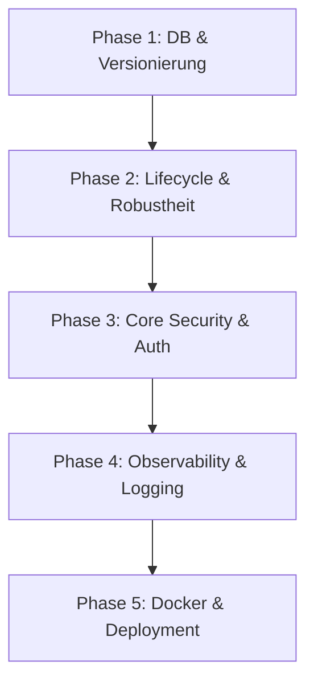

# GravityLAN — 15 Verbesserungen Umsetzungsplan

Dieses Dokument beschreibt den detaillierten, risikominimierten Phasenplan zur Implementierung der 15 identifizierten Verbesserungen in GravityLAN. Ziel ist es, die Änderungen in kleine, unabhängig testbare und reviewbare Abschnitte zu unterteilen, um Regressionen zu vermeiden und die Systemstabilität zu gewährleisten.

---

## 1. Empfohlene Umsetzungsreihenfolge

Die 15 Verbesserungen werden in **5 logische Phasen** gruppiert. Diese Reihenfolge minimiert Abhängigkeitskonflikte, da grundlegende Schichten (Datenbank, Konfiguration) zuerst stabilisiert werden, bevor darauf aufbauende APIs, Sicherheitsmechanismen und schlussendlich die Deployment-Artefakte angepasst werden.



- **Phase 1: DB & Versionierung (Fundament)** — Verbesserungen 7, 8, 12
- **Phase 2: Lifecycle & Robustheit (Laufzeit)** — Verbesserungen 3, 4, 11
- **Phase 3: Core Security & Auth (Absicherung)** — Verbesserungen 1, 2, 6, 13
- **Phase 4: Observability & Logging (Transparenz)** — Verbesserungen 5, 14
- **Phase 5: Docker & Deployment (Verpackung)** — Verbesserungen 9, 10, 15

---

## 2. Detaillierter Phasenplan

---

### Phase 1: DB & Versionierung (Fundament)

#### Ziel
Saubere Trennung von Tabellenerstellung und Schema-Migrationen unter Berücksichtigung verschiedener SQL-Dialekte (SQLite und PostgreSQL/MySQL). Konsolidierung der Versionsnummer auf eine Single Source of Truth.

#### Betroffene Dateien
- [backend/app/database/__init__.py](file:///e:/Users/Oliver/Etc/Projekte/Antigravity/GravityLAN/backend/app/database/__init__.py)
- [backend/app/database/migrations.py](file:///e:/Users/Oliver/Etc/Projekte/Antigravity/GravityLAN/backend/app/database/migrations.py)
- [backend/app/config.py](file:///e:/Users/Oliver/Etc/Projekte/Antigravity/GravityLAN/backend/app/config.py)
- [backend/app/main.py](file:///e:/Users/Oliver/Etc/Projekte/Antigravity/GravityLAN/backend/app/main.py)

#### Warum diese Phase an dieser Stelle kommt
Bevor tiefe Eingriffe in APIs oder Logins vorgenommen werden, muss die Datenbankschicht absolut stabil sein. Wenn alternative Datenbanken (z. B. PostgreSQL im Homelab) unterstützt werden sollen, müssen Migrationsbefehle wie `PRAGMA` dialektabhängig gekapselt oder durch dialekt-unabhängige SQLAlchemy-Inspektionen ersetzt werden. Die Bereinigung der Versionierung stellt sicher, dass alle APIs und Builds die korrekte ID nutzen.

#### Risiken
- **Migrationsfehler**: Unvollständige Tabellenstrukturen bei Erstinstallation oder Schema-Upgrades älterer Datenbanken.
- **Dialekt-Inkompatibilität**: SQLAlchemy-Inspektion wirft Fehler auf unerwarteten Triebwerken (z. B. aiosqlite vs. asyncpg).

#### Vorgeschlagene Commits
1. `refactor(db): separate tables init from migrations and use dialect-agnostic inspection`
   - Implementierung von SQLAlchemy `inspect` innerhalb von `run_migrations` unter Verwendung von `conn.run_sync()`.
   - Beseitigung SQLite-spezifischer raw SQL `PRAGMA table_info` durch SQLAlchemy Inspector-Abfragen.
2. `feat(version): enforce single source of truth for versioning`
   - Import von `VERSION` aus `app.version` direkt in `app.config` zur dynamischen Belegung von `app_version` in `Settings`.
   - Bereinigung doppelter Hardcoding-Pfade in `main.py` und Anpassung aller API-Routen auf `settings.app_version`.

---

### Phase 2: Lifecycle, Konfiguration & Robustheit (Laufzeit)

#### Ziel
Sicherstellung eines geordneten und robusten Applikationsstarts sowie eines sauberen Shutdowns. Verhinderung verwaister Hintergrund-Tasks und Gewährleistung, dass ungültige Konfigurationen sofort zum kontrollierten Abbruch führen.

#### Betroffene Dateien
- [backend/app/config.py](file:///e:/Users/Oliver/Etc/Projekte/Antigravity/GravityLAN/backend/app/config.py)
- [backend/app/main.py](file:///e:/Users/Oliver/Etc/Projekte/Antigravity/GravityLAN/backend/app/main.py)

#### Warum diese Phase an dieser Stelle kommt
Ein stabiler App-Lifecycle schützt den Server vor Speicherlecks und undefinierten Zuständen. Pydantic-Settings-Validierung fängt Konfigurationsfehler (z. B. ungültige IP-Formate, fehlerhafte Worker-Zahlen) direkt beim Start ab, noch bevor die FastAPI-Instanz erzeugt wird. Die Ablösung von abruptem `sys.exit()` sorgt dafür, dass die uvicorn/fastapi-Lifespan-Kette im Fehlerfall sauber durchlaufen wird.

#### Risiken
- **Start-Abbruch (False Positive)**: Zu restriktive Validierungsregeln in Pydantic blockieren reguläre, gültige Homelab-Konfigurationen.
- **Task-Cleanup-Hänger**: Fehlerhafte Tasks weigern sich beim Shutdown abzubrechen und verzögern das Stoppen des Containers.

#### Vorgeschlagene Commits
1. `feat(config): extend configuration validation using pydantic validators`
   - Definition von Wertegrenzen (z. B. `scan_timeout > 0`, `scan_workers` zwischen 1 und 200, gültige Port-Bereiche) via Pydantic `Field` und `@field_validator`.
2. `refactor(lifecycle): replace sys.exit with bubble-up exceptions in lifespan`
   - Ersetzen von `sys.exit(1)` bei Dateisystem-Schreibfehlern durch Anheben einer passenden `RuntimeError` oder spezifischen `GravityLANError`-Exception.
3. `refactor(tasks): implement graceful background task management and cancellation`
   - Speicherung von Hintergrund-Tasks (wie `prune_metrics_loop` oder Scan-Task-Referenzen) in `app.state.background_tasks`.
   - Expliziter Abbruch (`task.cancel()`) und kontrolliertes Awaiten aller Tasks im Shutdown-Zweig des async-lifespan.

---

### Phase 3: Core Security, Session-Design & WebSockets

#### Ziel
Modernisierung des Authentifizierungsdesigns durch Einführung dynamischer, zeitlich begrenzter Nutzersitzungen anstelle der dauerhaften Speicherung des statischen Master-Tokens in Cookies. Härtung von Cookies, CORS und Vereinheitlichung der WebSocket-Authentifizierung.

#### Betroffene Dateien
- [backend/app/services/auth_service.py](file:///e:/Users/Oliver/Etc/Projekte/Antigravity/GravityLAN/backend/app/services/auth_service.py)
- [backend/app/api/auth.py](file:///e:/Users/Oliver/Etc/Projekte/Antigravity/GravityLAN/backend/app/api/auth.py)
- [backend/app/api/scanner.py](file:///e:/Users/Oliver/Etc/Projekte/Antigravity/GravityLAN/backend/app/api/scanner.py)
- [backend/app/api/agent.py](file:///e:/Users/Oliver/Etc/Projekte/Antigravity/GravityLAN/backend/app/api/agent.py)
- [backend/app/main.py](file:///e:/Users/Oliver/Etc/Projekte/Antigravity/GravityLAN/backend/app/main.py)
- [frontend/src/api/client.ts](file:///e:/Users/Oliver/Etc/Projekte/Antigravity/GravityLAN/frontend/src/api/client.ts)

#### Warum diese Phase an dieser Stelle kommt
Diese Phase behandelt die kritischsten Sicherheitsaspekte. Durch die Entkopplung von Admin-Sitzungen und dem statischen `api.master_token` wird das Diebstahlrisiko minimiert. Weil WebSockets eng mit der Cookie- und Token-Logik verknüpft sind, muss die WebSocket-Auth-Harmonisierung zeitgleich erfolgen.

#### Risiken
- **WebSocket-Verbindungsabbruch**: WebSockets verlieren unter Proxy-Umgebungen (z. B. Nginx, Cloudflare) die Verbindung, wenn Cookies oder Auth-Parameter inkonsistent sind.
- **Frontend-Bypass**: Ungültige Session-Token führen zu einer Endlos-Umleitungsschleife im Frontend, falls der HTTP-401-Abfangmechanismus blockiert.

#### Vorgeschlagene Commits
1. `feat(auth): design dynamic user sessions and phase out master token from cookies`
   - Erstellung einer neuen `UserSession`-Datenbanktabelle (oder In-Memory Cache) zur Speicherung kryptografisch sicherer, temporärer Sitzungs-IDs (`session_id`).
   - Abkehr von `master_token` in Cookies; Login stellt ein temporäres `session_id`-Cookie aus.
2. `security(auth): harden secure_cookies and restrict cors configurations`
   - Cookie-Konfiguration auf `SameSite="strict"`, `HttpOnly=True` und dynamische Erkennung von HTTPS (`request.url.scheme == "https"` bzw. `X-Forwarded-Proto`).
   - Bedingte Aktivierung des `CORSMiddleware` nur, wenn `cors_origins` explizit definiert ist. Deaktivierung von Wildcards (`*`), wenn Credentials aktiviert sind.
3. `refactor(ws): centralize and unify websocket authentication dependency`
   - Implementierung eines universellen, async WebSocket-Auth-Helpers (`authenticate_websocket`) in `api/auth.py`.
   - Migration von `main.py` (`logs_websocket`), `scanner.py` (`scan_websocket`) und `agent.py` (`agent_websocket`) auf diesen Helper zur Beseitigung von Code-Duplikaten.

---

### Phase 4: Observability, Error Handling & Logging

#### Ziel
Verbesserung der Wartbarkeit und Observability durch ein nachvollziehbareres Error-Handling mit Korrelations-IDs und robuste Logging-Filter, die Fehlermeldungen nicht versehentlich unterdrücken.

#### Betroffene Dateien
- [backend/app/main.py](file:///e:/Users/Oliver/Etc/Projekte/Antigravity/GravityLAN/backend/app/main.py)
- [backend/app/exceptions.py](file:///e:/Users/Oliver/Etc/Projekte/Antigravity/GravityLAN/backend/app/exceptions.py)

#### Warum diese Phase an dieser Stelle kommt
Sobald die geschäftskritische Auth- und Sessionlogik steht, wird die Diagnose-Schicht eingezogen. Durch Korrelations-IDs lassen sich Fehler im Frontend direkt im Backend-Log lokalisieren. Der verbesserte Log-Filter stellt sicher, dass kritische Vorfälle auch bei Polling-Endpunkten (wie Agenten-Heartbeats) protokolliert werden.

#### Risiken
- **Log-Überlastung**: Zu geschwätzige Fehlermeldungen bei periodisch wiederkehrenden Agenten-Fehlern können die Log-Dateien fluten.

#### Vorgeschlagene Commits
1. `feat(observability): inject correlation ids into request context and error responses`
   - Erstellung einer custom Middleware zur Generierung einer eindeutigen `correlation_id` (z. B. `GL-XXXXXX`) pro Request.
   - Übergabe dieser ID im `X-Correlation-ID` Response-Header und Rückgabe bei HTTP-500-Fehlern an das UI.
2. `refactor(logging): harden logging filter to prevent silencing error states`
   - Umschreiben des `PollingFilter` in `main.py`, sodass dieser Anfragen an Polling-Schnittstellen (z. B. `/api/agent/status/`) nur dann filtert, wenn der HTTP-Statuscode erfolgreich ist (z. B. `< 400`) und das Log-Level unter `WARNING` liegt.

---

### Phase 5: Docker, Compose & Deployment Hardening

#### Ziel
Schlankere und sicherere Container-Images durch ein Multi-Stage-Build-Konzept sowie die Bereinigung redundanter Deployments und die Verifikation der Frontend-Pakete.

#### Betroffene Dateien
- [Dockerfile](file:///e:/Users/Oliver/Etc/Projekte/Antigravity/GravityLAN/Dockerfile)
- [docker-compose.yml](file:///e:/Users/Oliver/Etc/Projekte/Antigravity/GravityLAN/docker-compose.yml)
- [docker-compose.unraid.yml](file:///e:/Users/Oliver/Etc/Projekte/Antigravity/GravityLAN/docker-compose.unraid.yml)
- [README.md](file:///e:/Users/Oliver/Etc/Projekte/Antigravity/GravityLAN/README.md)
- [frontend/package.json](file:///e:/Users/Oliver/Etc/Projekte/Antigravity/GravityLAN/frontend/package.json)

#### Warum diese Phase an dieser Stelle kommt
Am Ende des Zyklus steht die Auslieferung. Nachdem die Applikationsarchitektur und Sicherheit gehärtet wurden, wird das Dockerfile modernisiert. Es baut auf den stabilen Bibliotheken und der bereinigten Versionierung auf. Docker-Compose-Dateien und die Dokumentation werden konsistent darauf ausgerichtet.

#### Risiken
- **Build-Fehler im Container**: Das Weglassen von Compilern (`gcc`, `python3-dev`) im Runtime-Image führt zu Fehlern, falls pip-Pakete zur Laufzeit nativen Code kompilieren müssen. Dies wird durch Kopieren der vorkompilierten Wheels gelöst.

#### Vorgeschlagene Commits
1. `docker(engine): harden Dockerfile using multi-stage build and remove compilers`
   - Aufteilung des Python-Builds in eine temporäre Build-Stage (mit `gcc`, `python3-dev`, wheel compilation) und eine minimale Runtime-Stage.
   - Übertrag der installierten Packages per copy, sodass das finale Image frei von Compilern ist.
2. `docker(compose): align docker-compose configs and update documentation`
   - Abgleich von Umgebungsvariablen, Mounts, Capabilities (`NET_RAW`, `NET_ADMIN`) und Versionen zwischen `docker-compose.yml`, `docker-compose.unraid.yml` und `README.md`.
3. `build(frontend): verify package lock stability and enable strict compilation`
   - Prüfung und Festschreibung der Frontend-Abhängigkeiten in `package.json`, Hinzufügen von ESLint- und Prettier-Prüfungen sowie Test des Production-Builds (`npm run build`).

---

## 3. Welche Phasen dürfen nicht vermischt werden?

> [!WARNING]
> **Kritische Trennungsregeln**
> Um weitreichende Regressionen und schwer zu debuggende Nebeneffekte zu vermeiden, müssen folgende Phasen und Themen zwingend isoliert voneinander umgesetzt werden:

1. **Datenbank-Refactoring (Phase 1) und Session-Tabellen (Phase 3)**
   - *Warum?* Phase 1 stabilisiert die Migrations-Infrastruktur für bestehende Tabellen und Dialekte. Würde man gleichzeitig neue Tabellen (wie `UserSession` für das neue Auth-Design) einführen, vermischt man Infrastruktur-Änderungen mit funktionalen Code-Änderungen. Migrationsfehler wären kaum zu lokalisieren.
2. **Konfigurationsvalidierung (Phase 2) und CORS/Cookie-Restriktionen (Phase 3)**
   - *Warum?* Ein Fehler in der Pydantic-Konfigurationsvalidierung verhindert das Starten der App. Ein Fehler in der CORS- oder Cookie-Verarbeitung führt zu Netzwerk- und Browser-Blockaden im laufenden Betrieb. Werden beide gleichzeitig geändert und die App funktioniert nicht mehr, ist unklar, ob der Container-Start oder die Browser-Security das Problem ist.
3. **Docker-Härtung (Phase 5) und App-Lifecycle (Phase 2)**
   - *Warum?* Die Änderung des App-Lifecycles (Ablösung von `sys.exit`, Abbruch von Background-Tasks) beeinflusst direkt das Verhalten unter Docker (z. B. wie der Container auf `docker stop` reagiert). Das Docker-Image darf erst angefasst werden, wenn der Python-Lifecycle lokal absolut stabil läuft.

---

## 4. Minimal-invasive vs. strukturelle Evolution

Einige Verbesserungen sollten aus Sicherheits- und Stabilitätsgründen im ersten Schritt **minimal-invasiv** gelöst und erst in einem späteren Release **strukturell** ausgebaut werden:

| Thema | Minimal-Invasiver Erstschritt (Sofort-Schutz) | Strukturelle Zielarchitektur (Zukunft) |
| :--- | :--- | :--- |
| **Auth-Design & Session-Cookie** | Generierung einer signierten, temporären Session-ID im Cookie bei erfolgreichem Login. Überprüfung im Backend über ein In-Memory-Dictionary im Lifespan-State (0 DB-Abhängigkeiten). | Migration zu einer persistenten `UserSession`-Datenbanktabelle inklusive Ablaufzeitpunkten, Session-Revocation-API und Token-Rotation. |
| **WebSocket-Authentifizierung** | Extraktion der bestehenden WebSocket-Auth in eine globale Funktion in `api/auth.py`, die von allen drei WebSocket-Endpoints synchron aufgerufen wird. | Echte FastAPI-Dependency-Injection für WebSockets mit dediziertem Connection Manager und automatischem Heartbeat-Schutz. |
| **Konfigurationsvalidierung** | Hinzufügen einfacher Pydantic `@field_validator`-Methoden in der bestehenden `Settings`-Klasse in `config.py` für grundlegende Typprüfungen und Wertebereiche. | Auslagerung komplexer Konfigurationshierarchien in getrennte Konfigurationsklassen und Einführung eines UI-basierten Config-Validierungs-API-Endpoints. |
| **SQLite-Grenzen** | Optimierung der SQLite-Einstellungen (WAL-Mode, busy_timeout auf 30s erhöhen) und dialect-agnostische Schema-Prüfung mittels SQLAlchemy Inspector. | Einführung einer vollständigen Datenbankabstraktion (z. B. optionaler nativer PostgreSQL-Support via Docker-Compose gesteuert über Umgebungsvariablen). |

---

## 5. Phase X: Verifikations-Checkliste

Zur Abnahme jeder Phase müssen folgende Skripte und Verifikationen fehlerfrei durchlaufen:

```bash
# 1. Statische Analyse & Typprüfung
npx tsc --noEmit (Frontend)
python .agent/skills/lint-and-validate/scripts/lint_runner.py . (Backend)

# 2. Sicherheitsprüfung (P0)
python .agent/skills/vulnerability-scanner/scripts/security_scan.py .

# 3. Datenbank-Prüfung (Schema & Migrationen)
python .agent/db_check.py

# 4. Automatisierte Tests
python -m pytest backend/tests/
```

---
> [!NOTE]
> Dieser Umsetzungsplan wurde nach den strengen Vorgaben der GravityLAN-Entwicklungsrichtlinien erstellt und wartet auf Ihre Freigabe.

Überarbeite den vorliegenden Umsetzungsplan für die 15 GravityLAN-Verbesserungen kritisch und technisch präzise.

Der aktuelle Plan ist grundsätzlich brauchbar, soll aber vor der Umsetzung geschärft werden.

Achte bei der Überarbeitung besonders auf folgende Punkte:

1. Widersprüche entfernen
- Prüfe, ob sich Phasen oder vorgeschlagene Lösungen gegenseitig widersprechen.
- Beispiel: Wenn Phase 3 eine UserSession-Tabelle einführt, darf der Abschnitt „minimal-invasiver Erstschritt“ nicht gleichzeitig In-Memory-Sessions als primäre Zielumsetzung definieren, ohne klar zwischen kurzfristigem und strukturellem Pfad zu unterscheiden.
- Entscheide dich klar für:
  a) minimal-invasiver Erstschritt
  b) struktureller Folgeausbau
- Formuliere das eindeutig.

2. Security-Maßnahmen pragmatisch statt dogmatisch formulieren
- Prüfe Aussagen wie `SameSite="strict"` oder automatische HTTPS-Erkennung kritisch.
- Berücksichtige Homelab-, Reverse-Proxy- und Subdomain-Szenarien.
- Bevorzuge sichere, aber praxistaugliche Defaults.
- Wenn etwas konfigurierbar sein sollte, sage das klar.

3. Phasen sauberer schneiden
- Trenne Deployment-Themen von Frontend-Tooling-Themen.
- Dockerfile/Compose/README nicht unnötig mit ESLint/Prettier/Frontend-Strictness vermischen.
- Wenn nötig, füge eine eigene Phase oder einen separaten Commit-Block für Frontend-Build-Stabilität hinzu.

4. Prioritäten realistischer machen
- Unterscheide klar zwischen:
  - Sicherheitskritisch
  - Robustheitskritisch
  - Wartbarkeitsverbesserung
  - Nice-to-have
- Correlation-ID und ähnliche Maßnahmen nicht überkritisch priorisieren, wenn erst grundlegende Robustheitsprobleme gelöst werden müssen.

5. Verifikation realistischer formulieren
- Verwende keine implizite Annahme, dass alle genannten Prüfskripte existieren oder lauffähig sind.
- Formuliere stattdessen:
  - vorhandene Checks nutzen
  - fehlende Checks dokumentieren
  - notwendige manuelle Prüfungen benennen
- Keine Scheinsicherheit erzeugen.

6. Umsetzungsreihenfolge auf Reviewbarkeit optimieren
- Jede Phase soll in kleine, reviewbare Commits zerlegt bleiben.
- Vermeide Mischcommits.
- Nenne explizit, welche Commits unabhängig reviewbar sein müssen.

7. Ergebnisformat
Liefere den überarbeiteten Plan in dieser Struktur:
1. Kurzfazit: Was wurde am Plan korrigiert?
2. Überarbeitete Phasenreihenfolge
3. Überarbeiteter Phasenplan
4. Explizite Minimalstrategie vs. Zielarchitektur
5. Trennungsregeln / was nicht vermischt werden darf
6. Realistische Verifikationsstrategie
7. Empfohlener Startpunkt für die erste tatsächliche Implementierungsphase

Wichtig:
- Gib nicht nur Meta-Kritik, sondern liefere den verbesserten Plan direkt ausformuliert.
- Sei präzise und konsistent.
- Keine unnötige Ausschmückung.